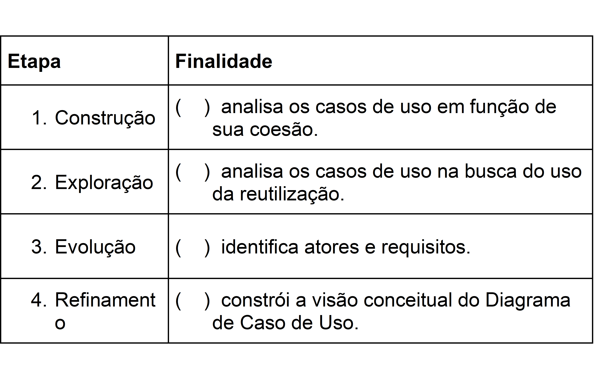

# Análise e Levantamento de Requisitos de Software: Diagrama de Caso de Uso - Processo de Aplicação

## Exercícios

## Questão 01 
Marque a alternativa que identifica a etapa de criação do Diagrama de Caso de uso onde são criados Coordenadores para obter maior coesão:

### Resposta:
- [ ] a) CONSTRUÇÃO
- [ ] b) ​EXPLORAÇÃO
- [x] c) ​ EVOLUÇÃO
- [ ] d) ​IMPLEMENTAÇÃO
- [ ] e) ​REFINAMENTO

> SOLUÇÃO DO PROFESSOR ✨
>
> ​A letra C é a alternativa correta, pois criar um coordenador é um procedimento que fazemos, quando for o caso, na etapa de Evolução.
>
> Prof. Carolyna Santiago

## Questão 02 
Considerando que em uma situação de negócio dois casos de uso realizam um conjunto de procedimentos iguais, qual deve ser a análise de um engenheiro de software para obter melhores resultados em seu projeto? Assinale a alternativa correta:

### Resposta:
- [ ] a) Deve criar um caso de uso coordenador para gerir os casos de uso comuns.
- [x] b) ​Deve criar um caso de uso com os procedimentos comuns e estabelecer a interação com os casos de uso de origem.
- [ ] c) ​Deve criar uma generalização de ator.
- [ ] d) ​Deve registrar e passar a equipe de desenvolvimento que utilize o mesmo código.
- [ ] e) ​Deve subdividir o caso de uso para partes menores, buscando a coesão.

> SOLUÇÃO DO PROFESSOR ✨
>
> ​A letra B é a alternativa correta, pois quando temos procedimentos comuns entre os casos de uso devemos criar um específico para estes procedimentos e interagir. O coordenador é criado quando os casos de uso possuem a função de realizar procedimentos de negócio e gerir outros, por exemplo. Generalização de ator é criada para indicar a realização de mesmos casos de uso por atores diferentes.
>
> Prof. Carolyna Santiago

## Questão 03 
Observe o seguinte Diagrama de Caso de Uso:

Considere que no estacionamento XXX, quando o cliente entra para estacionar, o atendente atualiza a vaga ocupada e entrega um comprovante de entrada para o cliente. Quando o cliente ainda não possui suas informações cadastradas, o atendente precisa cadastrar.

Marque a alternativa que indica o que se deve fazer em uma situação onde analisamos que um caso de uso está realizando objetivos diferentes, como é o caso do “Atualizar Vaga”:

### Resposta:
- [ ] a) Deve-se manter o caso de uso “Atualizar Vaga” com a função de alteração da informação de vaga e gestão dos casos de uso “Manter Cliente” e “Emitir Comprovante".
- [ ] b) ​Deve mudar a interação de “Manter Cliente” e “Emitir Comprovante" colocando direto ao ator, assim cada um seria independente.
- [ ] c) ​Deve mudar a interação de “Manter Cliente”colocando direto ao ator,  e “Emitir Comprovante" permaneceria ligado a “Atualizar Vaga”, assim estaria diminuindo a carga de trabalho do mesmo.
- [x] d) ​Deve criar um coordenador e estabelecer a interação deste novo caso de uso, na função de gerir os casos de uso, com “Atualizar Vaga”, “Manter Cliente” e “Emitir Comprovante".
- [ ] e) ​Deve representar uma generalização de caso de uso.

> SOLUÇÃO DO PROFESSOR ✨
>
> ​A letra D é a alternativa correta, pois para o caso apresentado, em que o caso de uso desempenha funções distintas, o indicado é criar um coordenador. Assim, obtém-se componentes coesos.
>
> Prof. Carolyna Santiago

## Questão 04 
​4. Correlacione as colunas referentes às finalidades de cada etapa de modelagem do Diagrama de Caso de Uso:

​Marque a alternativa CORRETA, considerando a numeração relacionada de cima para baixo:

### Resposta:
- [x] a) 3 - 4 - 2 - 1
- [ ] b) ​4 - 3 - 1 - 2
- [ ] c) ​1 - 2 - 3 - 4
- [ ] d) 2 - 1 - 4 - 3
- [ ] e) ​4 - 1 - 2 - 3

> SOLUÇÃO DO PROFESSOR ✨
>
> ​A letra A é a alternativa correta. As demais alternativas não possuem a definição relacionada corretamente.
>
> Prof. Carolyna Santiago

## Questão 05 
A modelagem do diagrama de caso de uso é um procedimento contínuo durante o processo de desenvolvimento de sistemas. O início da modelagem se dá com a identificação dos atores e casos de uso, denominada aqui por Exploração.

Marque a alternativa que define a etapa realizada após a Exploração, que apresenta a Visão Conceitual:

### Resposta:
- [x] a) CONSTRUÇÃO
- [ ] b) ​REFINAMENTO
- [ ] c) ​ELABORAÇÃO
- [ ] d) ​EVOLUÇÃO
- [ ] e) ​ELICITAÇÃO

> SOLUÇÃO DO PROFESSOR ✨
>
> ​A letra A é a alternativa correta, pois na etapa de CONSTRUÇÃO o diagrama de caso de uso - visão conceitual é criado, a partir da lista de atores e requisitos identificados junto aos usuários/stakeholders na etapa EXPLORAÇÃO. Nas etapas REFINAMENTO e EVOLUÇÃO são realizadas análises para tornar os casos de uso reutilizáveis e coesos, respectivamente. Já a Elicitação não se refere ao desenvolvimento do Diagrama de Caso de Uso.
>
> Prof. Carolyna Santiago

## Questão 06 
(Enade, 2014 - ADS)

Os requisitos de um sistema consistem nas descrições daquilo que o sistema deve fazer, dos serviços que oferece e das restrições a seu funcionamento.  Esses requisitos refletem as necessidades específicas dos clientes do sistema, como controlar um dispositivo, realizar um pedido ou encontrar informações.  O processo de descobrir, analisar, documentar e verificar esses serviços e restrições é denominado Engenharia de Requisitos.

Fonte: Sommerville, I. Engenharia de Software 9.ed. São Paulo, 2011 (adaptado)

Tendo o texto como referência, avalie as atribuições listadas a seguir, no que se refere ao estágio de especificação de requisitos em projetos de software:

I.   Identificar as expectativas e necessidades dos stakekolders com relação ao software a ser desenvolvido.

II. Distribuir os requisitos em categorias, explorar as relações entre eles e classificar sua importância para os stakeholders.

III. Produzir um documento de especificação de requisitos, de forma que todos os stakeholders possam atendê-lo.

IV.    Examinar a especificação do software para assegurar que todos os requisitos foram definidos sem inconsistências.

São atribuições na etapa de especificação de requisitos:

### Resposta:
- [ ] a) I e III, apenas.
- [ ] b) ​I e IV, apenas.
- [ ] c) ​II e III, apenas.
- [ ] d) ​II e IV, apenas.
- [x] e) ​I, II, III e IV.

> SOLUÇÃO DO PROFESSOR ✨
>
> ​A letra E é a alternativa correta, pois todas as afirmativas estão corretas como etapas da Especificação de Requisitos.
>
> Prof. Carolyna Santiago