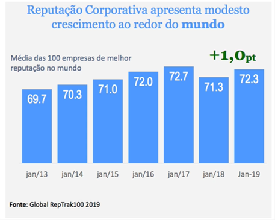
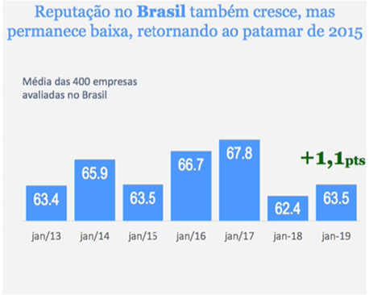
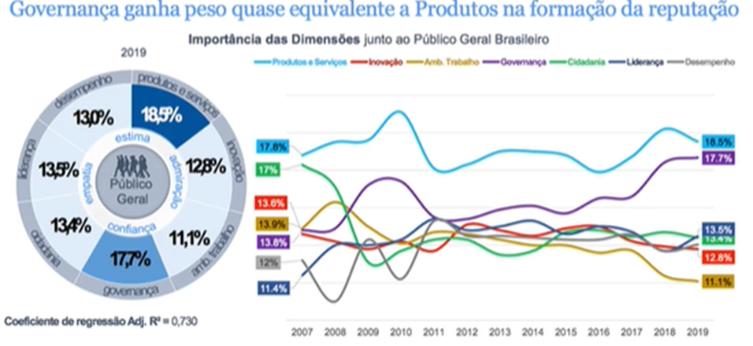

# Comunicação Empresarial: Mensuração e Classificação

## Questão 01 
Quando gerimos a reputação de uma organização, quais dos elementos abaixo são primordiais?

### Resposta:
- [ ] a) Criação de uma missão, visão e valores adequados
- [ ] b) Um plano de ação focado nos públicos de interesse mais sensíveis a problemas sociais e ambientais
- [ ] c) ​Gerenciamento de relacionamentos chave
- [x] d) ​Alternativas A e C estão corretas
- [ ] e) ​Todas as alternativas estão corretas

> SOLUÇÃO DO PROFESSOR ✨
>
> ​Para gerir a reputação, é primordial que a empresa desenvolva os aspectos de missão, visão e valores de forma coerente e adequada com a identidade criada, para que isso se transmita na comunicação. Isso se torna especialmente importante quando entendemos que a identidade (que é composta por missão, visão e valores) e a imagem precisam estar alinhadas para consolidar uma boa reputação.
> 
> Além disso, cuidar da reputação também é primordial visto que a empresa se relaciona com diversos públicos e deve se manter atenta a esses relacionamentos chaves. Nesse sentido, vale frisar que gerir a reputação não significa elaborar um plano de ação que foca somente nos públicos de interesse mais sensíveis às causas sociais/ambientais. A empresa precisa estar atenta a todos os seus relacionamentos chaves e públicos de interesse.
> 
> Prof. Carolyna Santiago

## Questão 02 
Leia atentamente o texto abaixo, as afirmações realizadas em relação ao mesmo e assinale a alternativa correta:

> …nenhum executivo, por maiores que sejam suas conquistas, pode dizer que só conheceu glórias até o último de seus dias na ativa. Carlos Ghosn, o executivo de origem brasileira, libanesa e francesa que até os 57 anos acumulara apenas triunfos notáveis, louvados retumbantemente pela mídia internacional de negócios, está no centro de um episódio constrangedor.
> 
> Provavelmente ele não perderá o cargo de presidente da Renault-Nissan, uma parceria improvável, mas extremamente bem-sucedida que é responsável por um em cada dez carros que circulam pelo mundo. Mas sua reputação sofreu um golpe rude. A biografia invicta de Ghosn, um poliglota cujas proezas nos negócios o fez herói de histórias em quadrinhos no Japão, foi enfim manchada por uma derrota.
> 
> A capacidade de julgamento de Ghosn é vista sob olhares bem menos admirados desde que ficou provado que, afinal, não houvera a espionagem em torno do carro elétrico da Renault que custou a demissão sob holofotes de três respeitados e veteranos executivos da montadora.
> 
> As acusações, enviadas em carta anônima, eram inteiramente falsas, conforme mostrou uma investigação em torno delas. Só que, talvez para demonstrar mais uma vez seu legendário sentido de urgência, Ghosn tomou providências sumárias contra os acusados antes que a inocência deles fosse comprovada.
> 
> Ele, que fora à televisão anunciar os crimes e as punições, teve de voltar a ela para se desdizer. Não foi apenas Ghosn que se movimentou bisonhamente antes da hora. No fragor dos acontecimentos, o presidente francês, Nicolas Sarkozy, conseguiu criar uma — mais uma, aliás — crise diplomática internacional ao anunciar publicamente que seria investigada a participação da China na alegada espionagem.
> Uma reunião de acionistas da Renault no início de maio era aguardada com ansiedade. Como ficaria Ghosn?
>
> (Revista Exame, 2011)

* Afirmação 1 - Um incidente como o descrito acima não afeta todos os pilares existentes na reputação de uma empresa
* Afirmação 2 - Comunicação Interna para sustentação do pilar reputacional de Governança pode ser uma boa opção para a Renault atingir a um grupo de stakeholders
* Afirmação 3 - A competência da Renault fica, após este ocorrido, seriamente comprometida
* Afirmação 4 - Os problemas de liderança e governança são claros neste episódio

### Resposta:
- [ ] a) Todas as afirmações estão corretas
- [ ] b) ​As afirmações 1, 2 e 3 estão corretas
- [x] c) ​As afirmações 1, 2 e 4 estão corretas
- [ ] d) ​As afirmações 1, 3 e 4 estão corretas
- [ ] e) ​As afirmações 2, 3 e 4 estão corretas

> SOLUÇÃO DO PROFESSOR ✨
>
> * Afirmação 1 - Um incidente como o descrito acima não afeta todos os pilares existentes na reputação de uma empresa. - CORRETA. O caso da Renault envolvendo o executivo Carlos Ghosn foi muito impactante, mas não podemos dizer que afeta todos os pilares reputacionais de uma empresa. Por exemplo, inovação e cidadania são alguns pilares não compreendidos por esse tipo de desafio enfrentado pela Renault. De acordo com o visto nesse caso, os indicadores afetados são principalmente os de liderança e governança
> * Afirmação 2 - Comunicação Interna para sustentação do pilar reputacional de Governança pode ser uma boa opção para a Renault atingir a um grupo de stakeholders. - CORRETA. Como um dos indicadores afetados no caso é o da governança, fortalecer esse pilar por meio da comunicação interna pode ser um caminho promissor para que a Renault administre essa crise enfrentada
> * Afirmação 3 - A competência da Renault fica, após este ocorrido, seriamente comprometida. - ERRADA. No caso visto, não podemos dizer que a competência da Renault como um todo fica seriamente comprometida, mas sim alguns pilares que fazem parte da reputação. Tanto é que, mesmo após o episódio, a Renault se manteve no mercado e conseguiu contornar a crise descrita. Portanto, nessa circunstância os aspectos comprometidos foram indicadores como liderança e governança
> * Afirmação 4 - Os problemas de liderança e governança são claros neste episódio. - CORRETA. O caso da Renault e as ações tomadas pelo executivo da empresa, Carlos Ghosn, acabam por evidenciar problemas relacionados com liderança e governança. Isso porque a liderança é o pilar que aponta se a empresa é bem administrada, tem bons gestores, possui um líder respeitado e forte e mostra se a empresa consegue ter uma visão clara de futuro; enquanto a governança está relacionada ao comportamento ético da empresa, se ela é justa, responsável e transparente
> 
> Prof. Carolyna Santiago

## Questão 03 
​Podemos afirmar que uma empresa bem administrada tende a ter resultados financeiros positivos e que vão ao encontro da expectativa de seus públicos de interesse. Em quais indicadores de uma pesquisa de reputação podemos avaliar se a afirmação acima é verdadeira?

### Resposta:
- [ ] a) ​Liderança e Inovação
- [ ] b) ​Desempenho Financeiro e Governança
- [ ] c) Governança e Liderança
- [x] d) ​Liderança e Desempenho Financeiro
- [ ] e) ​Governança e Cidadania

> SOLUÇÃO DO PROFESSOR ✨
>
> Uma empresa que é bem administrada está associada às questões de liderança, sendo este o indicador que aponta se a empresa é bem administrada, tem bons gestores, possui um líder respeitado e forte e mostra se a empresa consegue ter uma visão clara de futuro.
> 
> E os resultados financeiros positivos são expressos justamente pelo indicador de desempenho financeiro, pois ele está relacionado aos resultados financeiros da empresa, se ela é lucrativa e apresenta perspectiva de crescimento.
> Prof. Carolyna Santiago

## Questão 04 
Considere as seguintes afirmações:
* I - Governança atualmente é o 2o indicador mais importante na construção da Reputação de uma empresa
* II - Os índices de Reputação das empresas no Brasil e no Mundo vem apresentando aumentos tímidos
* III - Uma empresa com um índice maior do que 70 provavelmente estará colocada entre as de melhor Reputação em uma pesquisa
* IV - Ambiente de trabalho é o indicador com menos peso na construção da Reputação de uma empresa
Tendo como base as afirmações acima, assinale a alternativa correta:

### Resposta:
- [ ] a) ​Afirmações I, II e III estão corretas
- [ ] b) Afirmações II, III e IV estão corretas
- [ ] c) ​Apenas a afirmação II está correta
- [ ] d) ​Afirmações I, III e IV estão corretas
- [x] e) ​Todas as afirmações estão corretas

> SOLUÇÃO DO PROFESSOR ✨
>
> * I - Governança atualmente é o 2o indicador mais importante na construção da Reputação de uma empresa. - CORRETA. Conforme visto, a governança é o segundo indicador mais importante para a reputação, ficando atrás apenas do pilar de produtos e serviços. Segundo o que foi estudado, vemos que o indicador governança é o que tem a segunda maior porcentagem, representando 17,7% da reputação
> * II - Os índices de Reputação das empresas no Brasil e no Mundo vem apresentando aumentos tímidos. - CORRETA. Em 2019 houve um leve crescimento na reputação das empresas, por volta de mais 1 ponto. O mesmo ocorreu no Brasil, que aumentou em torno de 1,1 pontos
> * III - Uma empresa com um índice maior do que 70 provavelmente estará colocada entre as de melhor Reputação em uma pesquisa. - CORRETA. A média das empresas com melhor reputação do mundo é 70
> * IV - Ambiente de trabalho é o indicador com menos peso na construção da Reputação de uma empresa. - CORRETA. Conforme visto, o ambiente de trabalho é o indicador com menos impacto na reputação. Segundo o que foi estudado, vemos que o indicador ambiente de trabalho é o que tem a menor porcentagem, representando 11,1% da reputação
> 
> As imagens abaixo, tiradas do RepTrack 2019, demonstram como todas as afirmativas estão corretas. As duas primeiras imagens evidenciam que as afirmativas II e III estão corretas, enquanto a última imagem mostra como as afirmativas I e IV são corretas:
> 
> 
> 
>
> Prof. Carolyna Santiago

## Questão 05 
Quando ocorre um vazamento de petróleo em uma plataforma marítima (e este causa a poluição dos oceanos) quais pilares da Reputação da empresa causadora do mesmo são mais impactados?

### Resposta:
- [ ] a) Produtos e Serviços, Governança e Liderança
- [ ] b) Desempenho Financeiro, Inovação e Ambiente de Trabalho
- [x] c) ​Liderança, Governança e Cidadania
- [ ] d) Produtos e Serviços, Desempenho Financeiro e Inovação
- [ ] e) ​Liderança, Governança e Desempenho Financeiro

> SOLUÇÃO DO PROFESSOR ✨
>
> Em situações de crise em que há um vazamento de petróleo em uma plataforma marítima, ocasionando a poluição dos oceanos, podemos dizer que a empresa terá impactos reputacionais nos indicadores de liderança, governança e cidadania:
> * Liderança, pois expressa que a administração da empresa deveria ter atuado de forma mais eficiente para evitar esse tipo de ocorrência;
> * Governança, visto que esse indicador fala sobre como a empresa é da porta para dentro, se ela é ética, transparente e justa. No caso do vazamento, a postura ética da empresa passa a ser questionada;
> * Cidadania é o comportamento da empresa da porta para fora, pois representa se ela contribui para a sociedade, apoia causas sociais e protege o meio ambiente. Sendo assim, com o vazamento de petróleo esse pilar fica exposto, pois os danos causados à natureza são de grande impacto.
> 
> Prof. Carolyna Santiago

## Questão 06 
​Qual é hoje o indicador mais importante na construção da Reputação de uma empresa?

### Resposta:
- [x] a) ​Produtos e Serviços
- [ ] b) ​Governança
- [ ] c) ​Liderança
- [ ] d) ​Desempenho Financeiro
- [ ] e) ​Cidadania

> SOLUÇÃO DO PROFESSOR ✨
>
> Segundo os dados do RepTrack 2019, produtos e serviços é o indicador mais importante para a reputação, ou seja, é aquele que mais impacta na construção da média reputacional.
> 
> Conforme a imagem abaixo, vemos que o indicador produtos e serviços é o que tem a maior porcentagem, representando 18,5% da reputação
> 
> Prof. Carolyna Santiago