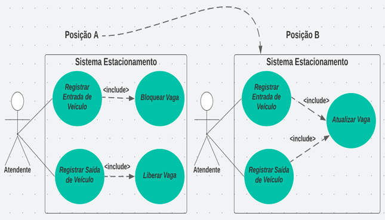

# Análise e Levantamento de Requisitos de Software: Diagrama de Caso de Uso - Processo de Construção

## Exercícios

## Questão 01 
A construção do Diagrama de Caso de uso considera a frequente alteração durante todo o processo de desenvolvimento.  Desta forma, passamos por 4 etapas: Exploração, Construção, Refinamento, Evolução.

Assinale a alternativa que descreve a finalidade da etapa CONSTRUÇÃO:

### Resposta:
- [x] a) Representa o diagrama a partir da análise dos atores e requisitos identificados.
- [ ] b) ​Identifica os atores e requisitos do contexto do negócio em estudo.
- [ ] c) Analisa procedimentos comuns a dois ou mais casos de uso, criando um novo caso de uso.
- [ ] d) ​Cria casos de uso coordenadores para obter maior coesão dos componentes.
- [ ] e) ​Subdivide caso de uso em casos de uso menores facilitando a manutenção e desenvolvimento.

> SOLUÇÃO DO PROFESSOR ✨
>
> A letra A é a alternativa correta, pois a etapa de Construção representa o diagrama de caso de uso a partir dos atores e requisitos identificados na etapa de Exploração, como é citado na letra B.​​
>
> Prof. Carolyna Santiago

## Questão 02 
Observe a seguinte figura:

Considerando a alteração sofrida no Diagrama de Caso de uso apresentado da Posição A para a Posição B, marque a alternativa CORRETA:

### Resposta:
- [ ] a) A alteração apresentada não se justifica, já que o estado da vaga é tratado de forma diferente pelos casos de uso.
- [ ] b) ​A alteração gerou um erro de representação, pois não se pode usar dois includes para um único caso de uso.
- [ ] c) ​Este tipo de alteração é realizada na fase de Evolução.
- [x] d) A alteração foi necessária a partir da análise de que tanto “Bloquear Vaga” quanto “Liberar Vaga” estariam atualizando a informação do estado da Vaga do estacionamento.
- [ ] e) ​A alteração não se aplica, pois o modelo apresentado na Situação A não deveria ter representado os casos de uso “Liberar Vaga” e “Bloquear Vaga”.

> SOLUÇÃO DO PROFESSOR ✨
>
> ​A letra D é a alternativa correta, pois esta alteração foi realizada a partir da análise de que os dois casos de uso “Liberar Vaga” e “Bloquear Vaga” realizavam os mesmos procedimentos. A alteração se justifica, podemos ter quantos includes forem necessários e a alteração é proposta na etapa de Refinamento.
>
> Prof. Carolyna Santiago

## Questão 03 
Supondo que o Engenheiro de Software verifique que alguns casos de uso são grandes, com número excessivo de ações e objetivos distintos.

A partir desta afirmação, assinale a alternativa CORRETA:

### Resposta:
- [ ] a) O engenheiro de software deve representar os casos de uso com número excessivo de ações como um coordenador.
- [x] b) ​O engenheiro de software deve subdividir o caso de uso com número excessivo de ações em casos de uso menores.​
- [ ] c) ​O engenheiro de software, apesar de identificar, não deve se preocupar, pois casos de uso com número excessivo de ações é favorável, porque são desenvolvidos menos componentes.
- [ ] d) ​O engenheiro de software deve buscar outros casos de uso que possam ser compartilhados e, assim, aplicar a reutilização.
- [ ] e) ​O engenheiro de software deve representar casos de uso para as partes comuns ao caso de uso com número excessivo de ações.

> SOLUÇÃO DO PROFESSOR ✨
>
> ​A letra B é a alternativa correta, pois em casos de uso com número excessivo de ações distintas, deve-se subdividir em casos de uso menores para obter maior coesão.
>
> Prof. Carolyna Santiago

## Questão 04 
Analise as seguintes afirmativas:

I - A criação de um Diagrama de Caso de uso sofre alterações durante todo o processo de desenvolvimento do sistema.

II - A etapa de Exploração na construção do Diagrama de Caso de Uso identifica os atores e requisitos do contexto de negócio e constrói a visão conceitual do modelo.

III - As etapas de Refinamento e Evolução são utilizadas na disciplina Análise da Engenharia de Software e faz com que o engenheiro de software identifique alterações que colaboram para a implementação dos componentes.

Assinale a alternativa CORRETA:

### Resposta:
- [ ] a) As afirmativas I e II estão corretas.
- [ ] b) ​As afirmativas II e III estão corretas.
- [x] c) ​As afirmativas I e III estão corretas.​
- [ ] d) As afirmativas I, II e III estão corretas.
- [ ] e) Somente a afirmativa I está correta.

> SOLUÇÃO DO PROFESSOR ✨
>
> ​A letra C é a alternativa correta, pois as afirmativas I e III estão corretas. A afirmativa II não está correta, porque a etapa de exploração identifica os atores e requisitos. A etapa de Construção que cria o modelo na visão conceitual.
>
> Prof. Carolyna Santiago

## Questão 05 

A coesão é o conceito aplicado para componentes que possuem um objetivo específico. Assinale a alternativa que identifica o motivo pelo qual devemos ter os componentes coesos nos sistemas:

### Resposta:
- [ ] a) Componentes coesos são importantes, mas considerados como secundários na análise de sistemas.
- [ ] b) ​Componentes coesos é uma técnica aplicada na etapa de Construção.
- [ ] c) ​Componentes coesos aumentam o esforço de desenvolvimento.
- [ ] d) ​Componentes coesos ocasionam retrabalho.
- [X] e) ​Componentes coesos facilitam a reutilização.

> SOLUÇÃO DO PROFESSOR ✨
>
> ​A letra E é a alternativa correta, pois ter componentes coesos na implementação de componentes facilita a reutilização, manutenção e diminui o esforço de desenvolvimento e teste. Não provoca retrabalho, técnica aplicada na etapa de Refinamento e Evolução e, são relevantes na análise de sistemas.
>
> Prof. Carolyna Santiago

## Questão 06 
Os diagramas de Caso e uso sofrem constantes atualizações durante  o processo de desenvolvimento de software

PORQUE

A metodologia Orientada a Objetos que definiu a UML como um padrão para a modelagem orientada a objetos tem como um dos princípios ser dirigido por Caso de Uso.

Acerca dessas asserções assinale a alternativa correta:

### Resposta:
- [ ] a) As duas asserções são proposições verdadeiras, mas a segunda não é uma justificativa correta da primeira.
- [x] b) ​As duas asserções são proposições verdadeiras, e a segunda é uma justificativa correta da primeira.
- [ ] c) A primeira asserção é uma proposição verdadeira, e a segunda, uma proposição falsa.
- [ ] d) ​A primeira asserção é uma proposição falsa, e a segunda, uma proposição verdadeira.
- [ ] e) ​Tanto a primeira quanto a segunda são asserções falsas e proposições falsas.

> SOLUÇÃO DO PROFESSOR ✨
>
> ​A letra B é a alternativa correta, pois as asserções são verdadeiras e a segunda asserção é uma justificativa da primeira.
>
> Prof. Carolyna Santiago
