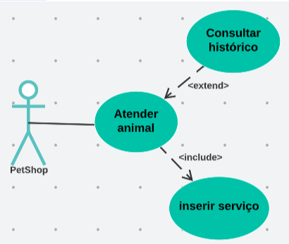
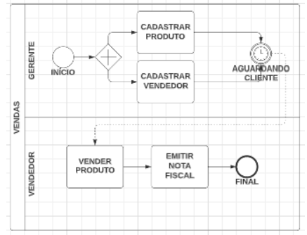

# Simulado 02

## Exercícios

## Questão 01 
Suponha que você foi contratado para o desenvolvimento de um sistema para uma Pet Shop e deve ler o diagrama de caso de uso a seguir, para entendimento dos requisitos

Analise as afirmativas a seguir e verifique as verdadeiras em relação a leitura das representações:
 
I - O caso de uso “Inserir serviço” vai ser realizado somente quando for a primeira vez do animal na Pet Shop;
II - A interação do tipo <extend> expressa que o caso de uso estendido será realizado em função de uma regra de negócio;
III - O caso de uso “Consultar histórico” será sempre realizado em função da interação “Inserir serviço”;
IV - O caso de uso “Inserir serviço” será sempre realizado e, o caso de uso “Consultar histórico” será realizado apenas quando alguma regra for atendida, por exemplo, se o animal for cliente ou o atendente desejar;

Marque a alternativa CORRETA.

### Resposta:
- [ ] a) As afirmativas I e III estão corretas.
- [ ] b) As afirmativas I e IV estão corretas.
- [ ] c) As afirmativas III e IV estão corretas.
- [ ] d) As afirmativas I e II estão corretas.
- [x] e) As afirmativas II e IV estão corretas.

> SOLUÇÃO DO PROFESSOR ✨
>
> A interação <include> implica na realização SEMPRE ocorrer e a interação <extend> será realizada em função de uma regra de negócio. As demais não estão corretas, pois não é possível visualizar as regras que estão internas aos casos de uso no Diagrama de Caso de Uso.
>
> Prof. Wanessa Rastoldo

## Questão 02 
Todo desenvolvimento de software tem como foco ter qualidade de software. Muitos mecanismos são utilizados para atingir esse objetivo.
Analise as afirmativas referentes a procedimentos realizados na obtenção de qualidade de software.
 
I - Construção de programas com estruturas organizadas e bem estruturadas.
II - Requisitos corretos e completos.
III - Estabelecer o controle de versões do software produzido.
IV - Ter os usuários envolvidos no processo de desenvolvimento.

Marque a alternativa CORRETA.
 
### Resposta:
- [x] a) As afirmativas I, II, III e IV estão corretas.
- [ ] b) As afirmativas I, II e III estão corretas.
- [ ] c) As afirmativas I, II e IV estão corretas.
- [ ] d) As afirmativas II, III e IV estão corretas.
- [ ] e) Somente as afirmativas I e III estão corretas.

> SOLUÇÃO DO PROFESSOR ✨
>
> As afirmativas II e IV se referem a práticas no desenvolvimento de software que trazem qualidade, pois quanto mais envolvimento do usuário no desenvolvimento, requisitos completos e corretos serão abordados, o que levará o software a atendimento das expectativas do usuário, fator de qualidade. As afirmativas I e III referem-se a requisitos técnicos, necessários na garantia de continuidade do software.
>
> Prof. Wanessa Rastoldo

## Questão 03 
Realizar manutenção em softwares é um procedimento realizado para que possamos estar atualizados em novos cenários.
Analise as seguintes afirmativas, que correspondem a atividades do processo de manutenção.

I - Identificar prioridades para realização dos ajustes.
II - Definir indicadores de qualidade para medição.
III - Construir modelos funcionais e dados.
IV - Realizar um estudo de viabilidade, analisando custos e benefícios.

Marque a alternativa CORRETA.

### Resposta:
- [ ] a) As afirmativas I, II e III estão corretas.
- [ ] b) As afirmativas I, II e IV estão corretas.
- [ ] c) As afirmativas II, III e IV estão corretas.
- [x] d) Somente as afirmativas I e IV estão corretas.
- [ ] e) As afirmativas I, II, III e IV estão corretas.

> SOLUÇÃO DO PROFESSOR ✨
>
> A afirmativa I e IV estão corretas. Fazem parte das atividades do processo de manutenção, além das atividades de levantamento de requisitos, análise, projeto, implementação, teste e implantação. A afirmativa II refere-se a uma atividade da Gerência de Qualidade. A afirmativa III não está correta, pois no processo de manutenção os modelos são atualizados e não construídos.
>
> Prof. Wanessa Rastoldo

## Questão 04 
No processo de desenvolvimento de software o uso de modelos é essencial para facilitar a comunicação com os usuários, compor a documentação e também gerar transparência no time de desenvolvimento, mas para entendimento completo usamos as descrições de caso de uso detalhando os passos a serem realizados em atendimento ao requisito analisado.
Marque a alternativa que representa uma preocupação na descrição de caso de uso.

### Resposta:
- [ ] a) Utilizar condições facilita visualizar os caminhos que os procedimentos terão que seguir no fluxo da realização.
- [ ] b) As interações <extend> e <include> não são representadas.
- [x] c) A realização das ações são apresentadas a partir da interação do ator e sistema.
- [ ] d) Toda descrição é elaborada no formato textual para facilitar a compreensão.
- [ ] e) Considera-se como boa prática utilizar verbos diferenciados para expressar as mesmas ações.

> SOLUÇÃO DO PROFESSOR ✨
>
> A alternativa A está errada porque na descrição de caso de uso não se representa condições, repetição, nem controles. A afirmativa B está errada, pois as interações de <include> e <extend> são representadas para dar visibilidade do momento de realização e a interação entre os casos de uso. A afirmativa D está errada porque temos dois tipos de descrição: expandida e não expandida. A não expandida apresenta uma descrição no formato textual, mas é para casos de uso que possuem poucas regras e a descrição expandida é usada para casos de uso complexos e são representados por sentenças associadas à atuação do ator e sistema na interação. A letra D está errada porque é importante a padronização de verbos utilizados para o mesmo significado.
>
> Prof. Wanessa Rastoldo

## Questão 05 
Analise o seguinte modelo BPMN:

Avaliando a proposta da simbologia BPD apresentada analise as seguintes afirmativas:

I - As atividades “Cadastrar Produto” e “Cadastrar Vendedor” são realizadas a partir do atendimento de uma condição.
II - O símbolo identificado por “Aguardando Cliente” significa que o fluxo somente dará continuidade quando o cliente chegar à loja.
III - As atividades “Vender Produto” e “Emitir Nota Fiscal” são realizadas sequencialmente.
 
Marque a alternativa CORRETA.

### Resposta:
- [ ] a) As afirmativas I e II estão corretas.
- [x] b) As afirmativas II e III estão corretas.
- [ ] c) As afirmativas I e III estão corretas.
- [ ] d) As afirmativas I, II e III estão corretas.
- [ ] e) Somente a afirmativa III está correta.

> SOLUÇÃO DO PROFESSOR ✨
>
> A afirmativa I não está correta porque o símbolo apresentado para as atividades “Cadastrar Produto” e “Cadastrar Vendedor” representa que são atividades que podem ser realizadas em paralelo.
>
> Prof. Wanessa Rastoldo