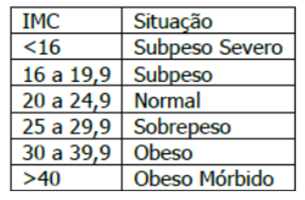
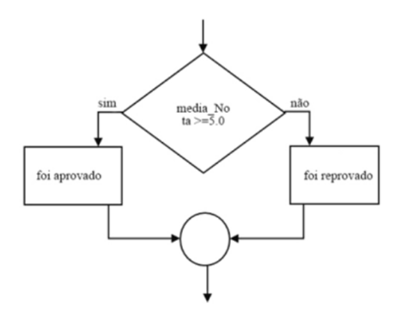
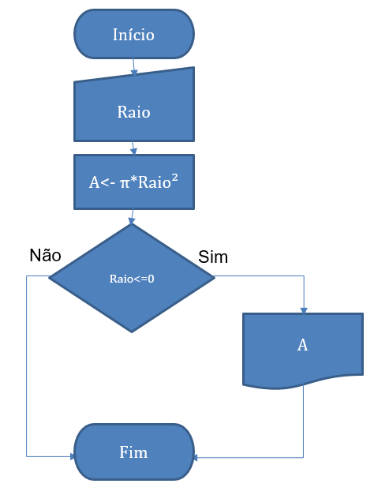
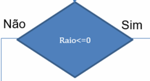
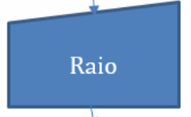
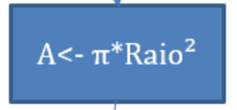
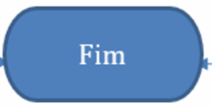

# Criação de Aplicações e Sistemas: Estrutura de Decisão

## Exercícios

## Questão 01 
(FAURGS - Adaptado) Leia o trecho a seguir:

“O que é um texto? Usamos tanto no nosso dia a dia que não paramos para pensar no que consiste um texto escrito na tela de um computador. Um texto é uma sequência de caracteres. Esta é uma definição óbvia, porém importante. Esses caracteres podem ser as letras comuns do alfabeto, mas também podem ser símbolos, sinais de pontuação, números e até caracteres que não são visíveis diretamente, mas cujo efeito podemos perceber.”

Fonte: RIBEIRO, J. A. Introdução à programação e aos algoritmos. 1. ed. Rio de Janeiro: LTC, 2019, p. 68.

Com base no texto acima e nos conteúdos abordados sobre Tomada de Decisão, considere a tabela a seguir, que contém dados do IMC (Índice de Massa Corporal) de uma pessoa, com uma escala típica de valores, dentre as várias existentes.

A fórmula para o cálculo do IMC é
IMC = PESO/ ALTURA²

Considerando a expressão acima e de acordo com a tabela, o comando
de tomada de decisão, em pseudocódigo, que expressa corretamente a
lógica para calcular e imprimir o resultado do IMC para um dos dois casos
extremos (subpeso severo ou obesidade mórbida) é:
### Resposta:
- [x] a) ​se IMC <16 OR IMC >40 então IMPRIMIR IMC
- [ ] b) ​se IMC <17 OR IMC >41 então IMPRIMIR IMC
- [ ] c) ​se IMC <15 AND IMC >39 então IMPRIMIR IMC
- [ ] d) ​se IMC >16 AND IMC <40 então IMPRIMIR IMC
- [ ] e) ​se IMC >17 AND IMC <41 então IMPRIMIR IMC

> SOLUÇÃO DO PROFESSOR ✨
>
> ​Letra A. Conforme a tabela exibida na questão, o comando de tomada de decisão correto para o cálculo do IMC, em pseudocódigo, dos dois casos é: “se IMC <16 OR IMC >40 então IMPRIMIR IMC”. Abaixo de 16 tem-se uma situação de subpeso severo e acima de 40 obesidade mórbida​

Prof. Ricardo Monteiro

## Questão 02 
(CESPE / CEBRASPE - Adaptada) Leia o trecho a seguir:
“Imagine a seguinte situação: um programa que apresenta a média escolar de um aluno. Até aqui, muito simples, mas além de calcular a média, o programa deve apresentar se ele está aprovado ou reprovado, segundo a análise de sua média. Será necessário verificar a média do aluno para então tomar uma decisão no sentido de apresentar a sua real situação: aprovado ou reprovado. Para solucionar o problema proposto, é necessário trabalhar uma nova instrução […] Sendo a condição Verdadeira, serão executadas todas as instruções que estejam entre o comando se…entao e o comando fimse, e para condição Falsa senão… e o comando fimse.” (grifo do autor)

Fonte: MANZANO, J. A. N. G.; OLIVEIRA, J. F. Estudo Dirigido de Algoritmos. 15. ed. São Paulo: Érica, 2012, p. 60.

A partir do texto acima e dos conhecimentos sobre Tomada de Decisão, analise o diagrama a seguir:

​A estrutura lógica presente no diagrama apresentado é do tipo:
### Resposta:
- [ ] a) ​SE ENTÃO
- [ ] b) ​CASO SELECIONE
- [ ] c) ​CASO REPITA
- [x] d) ​SE ENTÃO SENÃO
- [ ] e) ​SE SOMENTE SE

> SOLUÇÃO DO PROFESSOR ✨
>
> Letra D. A partir do resultado de uma expressão booleana (VERDADEIRO ou FALSO), o fluxo do algoritmo segue para um bloco de instruções ou não, visto que o bloco de código SENÃO é opcional. No diagrama da questão é utilizada essa estrutura, a qual apresenta as seguintes características:

SE expressão booleana

ENTÃO

instruções a serem executadas caso a expressão booleana resulte em VERDADEIRO

SENÃO

instruções a serem executadas caso a expressão booleana resulte em FALSO

FIM-SE

Prof. Ricardo Monteiro

## Questão 03 
(IBFC - Adaptada) Leia o trecho a seguir:
“A tomada de decisão executada por um computador estabelece uma ação de desvio na operação do fluxo do programa. Desta forma, um determinado trecho do programa pode realizar uma ou outra tarefa de processamento.”

Fonte: MANZANO, J. A. N. G.; OLIVEIRA, J. F. Estudo Dirigido de Algoritmos. 15. ed. São Paulo: Érica, 2012, p. 59.

A partir do texto e dos conhecimentos sobre Tomada de Decisão, sabendo que é comum que em linguagem de programação sejam aplicados diferentes tipos de dados; aqueles que são usados como resultados de expressões condicionais, possuindo apenas dois valores, um correspondente a verdadeiro e outro a falso, são do tipo:
### Resposta:
- [ ] a) ​Literal
- [ ] b) ​Inteiro
- [ ] c) ​Real
- [ ] d) Decimal
- [x] e) ​Lógico

> SOLUÇÃO DO PROFESSOR ✨
>
> ​Letra E. O tipo lógico é um tipo de dado utilizado na programação de computadores, visto que em operações lógicas o resultado será sempre um valor VERDADEIRO ou FALSO e apenas um dos valores pode ser escolhido​

Prof. Ricardo Monteiro

## Questão 04 
Leia o trecho a seguir:
“A forma mais básica de tomada de decisão é o esquema que faz a seleção entre duas alternativas[…] Passando o fluxograma para pseudocódigo, temos: ‘Se uma condição for verdadeira faça algo senão faça outra coisa’.”

Fonte: RIBEIRO, J. A. Introdução à programação e aos algoritmos. 1. ed. Rio de Janeiro: LTC, 2019, p. 82.

Com base no texto acima e nos conteúdos abordados sobre Tomada de Decisão, analise o diagrama (Fluxograma) a seguir.

### Resposta:
- [x] a)  indica a estrutura de Decisão
- [ ] b)  indica a estrutura de Decisão
- [ ] c)  indica a estrutura de Decisão
- [ ] d)  indica a estrutura de Decisão
- [ ] e)  indica a estrutura de Decisão

> SOLUÇÃO DO PROFESSOR ✨
>
> ​Letra A. O losango representa a estrutura de decisão em um fluxograma, se a condição for verdadeira executa alguns comandos, senão executa outros comandos.​

Prof. Ricardo Monteiro

## Questão 05 
Leia o trecho a seguir:

Um grupo de desenvolvedores está discutindo sobre a estrutura de controle tomada de decisão. A estrutura em questão apresenta as seguintes características: para verificar uma condição o usuário deve inserir um valor na tela, se o valor estiver correto, será apresentada a mensagem “Bem-vindo”.

Com base no texto e nos seus conhecimentos sobre Tomada de Decisão, considere a afirmativas a seguir:

I - A tomada de decisão em questão apresenta uma estrutura composta, com os comandos SE, SENAO e FIMSE

II - A tela exibirá a mensagem Bem-vindo se a condição for Verdadeira, de modo que que serão executadas todas as instruções que estejam entre o comando SE ENTAO e o comando FIMSE

III - O seguinte problema tem a mesma estrutura da tomada de decisão discutida pelos desenvolvedores: ler dois valores numéricos, efetuar a adição e apresentar o seu resultado caso o valor somado seja maior que 10

IV - Se a condição for Falsa não aparecerá a mensagem Bem-vindo, porque serão executadas as instruções que estiverem após o comando FIMSE

Está correto o que se afirma em:
### Resposta:
- [ ] a) ​I, II e IV
- [ ] b) ​II e III
- [ ] c) ​III e IV
- [x] d) ​II, III e IV
- [ ] e) ​apenas I

> SOLUÇÃO DO PROFESSOR ✨
>
> Letra D. A assertiva I está incorreta porque a tomada de decisão em questão apresenta uma estrutura simples, com os comandos SE e FIMSE. A assertiva II está correta, pois o programa apresentou a mensagem de boas vindas quando o usuário inseriu o código verdadeiro. A assertiva III está correta, porque podemos escrever o pseudocódigo do problema descrito com uma estrutura simples, da mesma forma que o problema do enunciado. Veja a seguir:

algoritmo “SOMANUMEROS”
var
X, A, B : inteiro
inicio
leia (A)
leia (B)
X<-A+B
SE (X > 10) ENTAO
escreva (X)
FIMSE
fim

Por fim, a assertiva IV está correta, visto que, caso o usuário insira um código falso, o programa não precisa realizar nenhuma ação, pelo fato de se estar utilizando uma estrutura de controle tomada de decisão simples.

Prof. Ricardo Monteiro

## Questão 06 
Leia o trecho a seguir:
“Existem casos em que é necessário estabelecer verificações de condições sucessivas, em que uma ação pode ser executada se um conjunto anterior de instruções ou condições for satisfeito. Sendo a ação executada, ela pode ainda estabelecer novas condições, o que significa fazer uso de uma condição dentro de outra condição.”

Fonte: MANZANO, J. A. N. G.; OLIVEIRA, J. F. Estudo Dirigido de Algoritmos. 15. ed. São Paulo: Érica, 2012, p. 69.

A partir do texto e dos seus conhecimentos sobre Tomada de Decisão, a estrutura descrita torna possível a realização de múltiplas verificações condicionais em um pseudocódigo, sendo conhecida como:
### Resposta:
- [ ] a) ​Desvio Condicional Composto ou Sequencial
- [ ] b) ​Desvio Condicional Simples
- [x] c) ​Desvio Condicional Aninhado ou Encadeado
- [ ] d) ​Laço de repetição
- [ ] e) Desvio Condicional por Seleção

> SOLUÇÃO DO PROFESSOR ✨
>
> Letra C. O Desvio Condicional Aninhado ou Encadeado permite realizar verificações condicionais múltiplas. A seguir veja um exemplo desse tipo de estrutura:

se (<condição1>) entao
<instruções para condição1 verdadeira>
senao
se (<condição2>) entao
<instruções para condição2 verdadeira, porém condição1 falsa>
senao
<instruções para condição1 e condição2 falsa>
fimse
fimse

Prof. Ricardo Monteiro