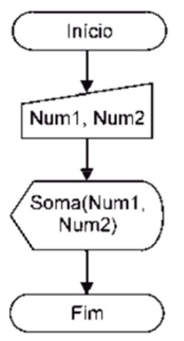
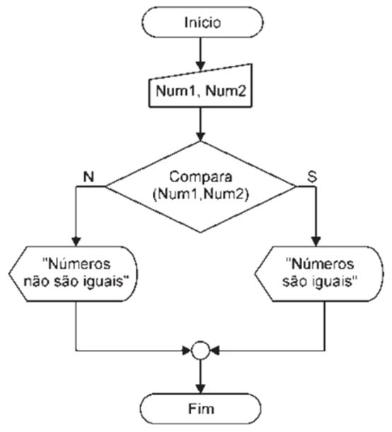

# Criação de Aplicações e Sistemas: Visão Geral da Linguagem Java

## Exercícios

## Questão 01 
Leia o pseudocódigo abaixo:

algoritmo “CALC_SOMA”
funcao soma(A, B : real) : real
inicio
var
SOMA: real
retorne SOMA <- A + B
fimfuncao
var
NUM1, NUM2 : real
inicio
escreva ("Informe o 1o. valor: " )
leia (NUM1)
escreva ("Informe o 2o. valor: " )
leia (NUM2)
escreva ("Soma = ", soma(NUM1, NUM2))
fimalgoritmo

Com base no algoritmo mostrado acima e nos seus conhecimentos sobre Funções, analise as etapas que são executadas pelo programa, e ordene-as de acordo com a sequência em que ocorrem.

( ) O resultado é implicado na variável soma que faz o retorno à função através de seu nome.
( ) O programa principal lê as variáveis NUM1 e NUM2.
( ) O programa principal transfere os valores das variáveis NUM1 e NUM2 para os parâmetros A e B do tipo real.
( ) É processada a soma dos dois valores.

Agora, assinale a alternativa que apresenta a sequência correta:
### Resposta:
- [ ] a) ​2, 4, 1, 3
- [x] b) ​4, 1, 2, 3
- [ ] c) ​2, 3, 1, 4
- [ ] d) ​3, 2, 4, 1
- [ ] e) ​1, 2, 3, 4

> SOLUÇÃO DO PROFESSOR ✨
>
> ​Letra B. O primeiro passo realizado é a leitura das variáveis NUM1 e NUM2 pelo programa principal (1). Em seguida, os valores das variáveis NUM1 e NUM2 são transferidos para os parâmetros A e B do tipo real, os quais assumem seus respectivos valores (2). Depois, é processada a soma dos dois valores (3). Por fim, a resposta é implicada na variável SOMA, que também é do tipo real, a qual faz o retorno à função através de seu nome (4)​

Prof. Ricardo Monteiro

## Questão 02 
Leia o texto abaixo:

A função soma, cujo pseudocódigo foi descrito na questão anterior, é representada graficamente através do diagrama de blocos mostrado abaixo.

Figura 1 - Diagrama de blocos da função soma. | Fonte: MANZANO, J. A. N. G.; OLIVEIRA, J. F. Estudo Dirigido de Algoritmos. 15. ed. São Paulo: Érica, 2012, p. 207.
Figura 1 - Diagrama de blocos da função soma. | Fonte: MANZANO, J. A. N. G.; OLIVEIRA, J. F. Estudo Dirigido de Algoritmos. 15. ed. São Paulo: Érica, 2012, p. 207.

​Com base no diagrama de blocos e nos seus conhecimentos sobre Funções, é correto afirmar que a função apresenta, respectivamente:
### Resposta:
- [ ] a) ​Uma variável de entrada e duas de saída
- [ ] b) ​Uma variável de entrada e uma de saída
- [ ] c) ​Duas variáveis de entrada e duas de saída
- [x] d) ​Duas variáveis de entrada e uma de saída
- [ ] e) ​Nenhuma variável de entrada e uma de saída

> SOLUÇÃO DO PROFESSOR ✨
>
> ​Letra D. A função soma em questão recebe dois valores, tendo duas variáveis de entrada, NUM1 E NUM 2, e retorna a soma deles, que consiste na variável de saída​

Prof. Ricardo Monteiro

## Questão 03 
Leia o pseudocódigo abaixo:

algoritmo “COMPARAÇÃO”

funcao compara(c, f : real) : lógico

inicio

retorna c = f

fimfuncao

var n1, n2 : real

inicio

escreva ("Informe o 1o. valor: " )

leia (NUM1)

escreva ("Informe o 2o. valor: ")

leia (NUM2)

se (compara(n1, n2)) então

escreva “Números iguais”

senao

escreva “Números diferentes”

fimse

fimalgoritmo

Com base no algoritmo mostrado acima e nos seus conhecimentos sobre Funções, analise as etapas que são executadas pelo programa, e ordene-as de acordo com a sequência em que ocorrem

( ) Efetuar a comparação para determinar se os valores são iguais ou diferentes
( ) Chama a função para retornar o resultado, que consiste numa condição falsa ou verdadeira após a validação da expressão na função
( ) O algoritmo solicita os valores n1 e n2 aos usuários
( ) As variáveis n1 e n2 são declaradas no VAR e são do tipo Real
Agora, assinale a alternativa que apresenta a sequência correta:
### Resposta:
- [ ] a) ​2, 1, 3, 4
- [ ] b) ​3, 4, 2, 1
- [ ] c) ​2, 4, 1, 3
- [ ] d) ​1, 3, 4 2
- [x] e) ​4, 3, 2, 1

> SOLUÇÃO DO PROFESSOR ✨
>
> ​Letra E. O programa principal primeiro faz a leitura das variáveis n1 e n2 (1). Depois, os valores de n1 e n2 são transferidos para os parâmetros c e f, do tipo real, que assumem os seus respectivos valores (2). Em seguida, é processada a comparação dos dois valores (3). Por fim, a resposta é implicada na função pelo seu retorno (4).​

Prof. Ricardo Monteiro

## Questão 04 
Leia o texto abaixo:

A função comparação, cujo pseudocódigo foi descrito na questão anterior, é representada graficamente através do diagrama de blocos mostrado abaixo.

Figura 1 - Diagrama de blocos da função comparação. | Fonte: MANZANO, J. A. N. G.; OLIVEIRA, J. F. Estudo Dirigido de Algoritmos. 15. ed. São Paulo: Érica, 2012, p. 208.
Figura 1 - Diagrama de blocos da função comparação. | Fonte: MANZANO, J. A. N. G.; OLIVEIRA, J. F. Estudo Dirigido de Algoritmos. 15. ed. São Paulo: Érica, 2012, p. 208.

​Com base no diagrama de blocos e nos seus conhecimentos sobre Funções, é correto afirmar que a função retorna valores classificados como:
### Resposta:
- [ ] a) ​Real
- [ ] b) ​Literal
- [x] c) ​Lógico
- [ ] d) ​Inteiro
- [ ] e) ​Caractere

> SOLUÇÃO DO PROFESSOR ✨
>
> Letra C. Ao ser executado o programa, a função retorna ao final uma condição falsa ou verdadeira. Portanto, o retorno da função é do tipo lógico​

Prof. Ricardo Monteiro

## Questão 05 
Leia o texto abaixo:
A professora Débora propôs a criação de uma sub-rotina de função que execute cálculos segundo o parâmetro de operação fornecido. Abaixo é exibido o pseudocódigo simplificado do programa, sem as sub-rotinas de cálculo de cada operação envolvida.

algoritmo “CALCULADORA”

funçao calculo (R, T : real, operador : caractere) : real
var c : real
inicio
caso operador
seja “+” faça retorne c <- R + T
seja “-” faça retorne c <- R - T
seja “*” faça retorne c <-R * T
seja “/” faça retorne c <-R / T
fimcaso
fimalgoritmo

Com base no pseudocódigo mostrado acima e nos seus conhecimentos sobre Funções, considere as afirmativas a seguir:

I. Se o operador fornecido for “+”, faz-se a soma dos dois valores.

II. Se o operador for “-”, subtrai-se necessariamente o valor menor do maior.

III. Se o operador for “*”, faz-se a multiplicação dos dois valores.

IV. Se o operador for “/”, divide-se necessariamente o valor maior pelo menor.

Está correto o que se afirma em:
### Resposta:
- [x] a) ​I e III
- [ ] b) ​II e III
- [ ] c) ​II e IV
- [ ] d) ​I, II e III
- [ ] e) ​II, III e IV

> SOLUÇÃO DO PROFESSOR ✨
>
> ​Letra A. A afirmativa I está correta, pois, de acordo com o código da função calculo, se o operador for “+”, efetua-se a soma dos dois valores de entrada. A afirmativa II está incorreta porque se o operador for “-”, faz-se a subtração entre R e T, na ordem em que foi feita a entrada dos mesmos pelo usuário. A afirmativa III está correta porque se o operador for “*”, efetua-se a multiplicação dos dois valores. A afirmativa IV está incorreta pois se o operador for “/”, faz-se a divisão de R por T, na ordem em que foi feita a entrada dos mesmos pelo usuário​

Prof. Ricardo Monteiro

## Questão 06 
Leia o trecho do pseudocódigo abaixo:

funcao f2 (N:inteiro) : real

var i: inteiro

result: real

inicio

result <- 1

para I de 1 até N passo 1 faca

result <- result*i

fimpara

retorna result

fimfuncao

Com base no algoritmo mostrado acima e nos seus conhecimentos sobre Funções, é correto afirmar que a função apresenta, respectivamente:
### Resposta:
- [x] a) ​Uma variável de entrada e uma de saída
- [ ] b) ​Duas variáveis de entrada e uma de saída
- [ ] c) ​Duas variáveis de entrada e duas de saída
- [ ] d) ​Uma variável de entrada e duas de saída
- [ ] e) ​Nenhuma variável de entrada e uma de saída

> SOLUÇÃO DO PROFESSOR ✨
>
> ​Letra A. Tratando-se de funções, o algoritmo apresenta somente uma variável de entrada e uma de saída, respectivamente​

Prof. Ricardo Monteiro