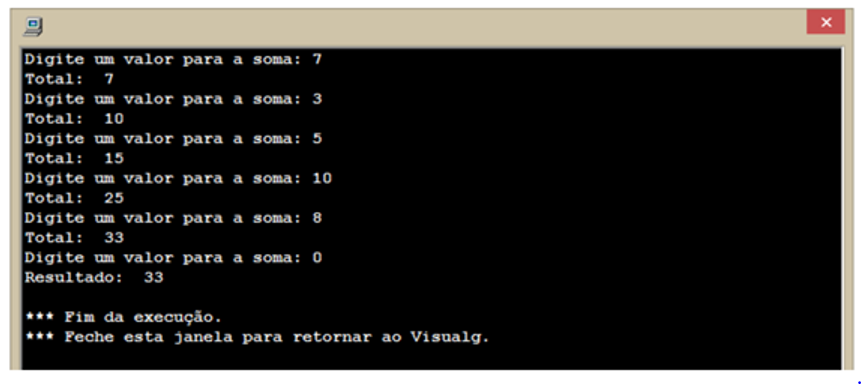

# Criação de Aplicações e Sistemas: Estrutura de Repetição

## Exercícios

## Questão 01 
Leia o trecho a seguir:
“Muitas vezes é necessário repetir um trecho de programa determinado número de vezes. Neste caso, pode ser utilizada a técnica de laço de repetição (looping ou malhas), que tem por finalidade efetuar o processamento de um trecho de instruções tantas vezes quantas forem necessárias.”

Fonte: MANZANO, J. A. N. G.; OLIVEIRA, J. F. Estudo Dirigido de Algoritmos. 15. ed. São Paulo: Érica, 2012, p. 89.

A partir do texto acima e dos conhecimentos sobre Repetição, analise o pseudocódigo a seguir:

​Assinale a alternativa que contém o número de vezes que será exibida a frase: Oi, tudo bem?
### Resposta:
- [x] a) 4
- [ ] b) 3
- [ ] c) 2
- [ ] d) 1
- [ ] e) 5

> SOLUÇÃO DO PROFESSOR ✨
>
> ​Letra A. Será exibida a frase 4 vezes, são elas: quando a variável de controle for 0, quando a variável de controle for 1, quando a variável de controle for 2 e quando a variável de controle for 3​

Prof. Ricardo Monteiro

## Questão 02 
Leia o trecho a seguir:
“Os laços de repetição podem ser classificados em duas formas, sendo laços de repetição interativa ou laços de repetição iterativa. São interativos quando necessitam da intervenção de um usuário para repetir a próxima ação do programa um indeterminado número de vezes, são laços iterativos quando executam as repetições previstas de forma automática determinado número de vezes.”

Fonte: MANZANO, J. A. N. G.; OLIVEIRA, J. F. Estudo Dirigido de Algoritmos. 15. ed. São Paulo: Érica, 2012, p. 89

Com base no texto acima e nos seus conhecimentos sobre Repetição, analise as afirmativas a seguir e assinale V para a(s) verdadeira(s) e F para a(s) falsa(s)

I. ( ) Um loop ou laço infinito é aquele que apresenta sempre uma condição de teste verdadeira, ou seja , nunca termina.

II. ( ) A instrução que realiza o teste lógico no início da repetição é enquanto.

III. ( ) Em algoritmos, precisamos executar alguns passos mais de uma vez. Ou mesmo executar repetidamente alguns passos até que alguma condição seja atendida. A partir dessa necessidade surgem as estruturas de repetição, também conhecidas como CONDICIONAIS.

IV. ( ) A instrução que realiza o teste lógico no fim da repetição é repita.

V. ( ) A estrutura que implementa a variável de controle e efetua o teste lógico é para.

Agora, assinale a alternativa que apresenta a sequência correta:
### Resposta:
- [ ] a) ​F, V, V, V, F
- [ ] b) ​V, F, F, V, V
- [ ] c) ​F, F, V, F, V
- [x] d) ​V, V, F, V, V
- [ ] e) ​F, V, V, F, F

> SOLUÇÃO DO PROFESSOR ✨
>
> ​A assertiva I está correta porque um laço (ou looping) nunca termina. A afirmativa II está correta, pois a instrução que realiza o teste lógico no início da repetição é enquanto. A afirmativa III está incorreta, pois Em algoritmos, precisamos executar alguns passos mais de uma vez. Ou mesmo executar repetidamente alguns passos até que alguma condição seja atendida. A partir dessa necessidade surgem as estruturas de repetição, também conhecidas como as instruções Enquanto, Para ou Repita. A afirmativa IV está correta, pois o comando Repita realiza o teste lógico no fim da repetição. Por fim, a assertiva V está correta, pois é a estrutura de repetição Para que implementa a variável de controle e efetua o teste lógico.​

Prof. Ricardo Monteiro

## Questão 03 
Leia o trecho a seguir:
“Existem comandos apropriados para realizar a repetição de determinados trechos de programa o número de vezes que for necessário. A vantagem desse recurso é que o programa passa a ser menor, podendo sua amplitude de processamento ser aumentada sem alterar o tamanho do código de programação. É possível determinar repetições com números variados de vezes.”

Fonte: MANZANO, J. A. N. G.; OLIVEIRA, J. F. Estudo Dirigido de Algoritmos. 15. ed. São Paulo: Érica, 2012, p. 89

Com base no texto acima e nos seus conhecimentos sobre Repetição, considere a afirmativas a seguir:

I - O comando de repetição é utilizado da seguinte forma: 
REPITA <sequência-de-comandos>
ATE <expressão-lógica>

II - A estrutura da instrução enquanto...faça...fimenquanto é uma estrutura condicional, e executa um conjunto de instruções enquanto a condição verificada for Falsa

III - O comando para é utilizado da seguinte forma: comandos PARA <variável> DE <valor inicial> ATE <valor final> FACA <sequência-de-comandos> FIMPARA

IV - Os laços que possuem um número finito de execuções podem ser processados pela estrutura para, por meio dos comandos para...de...até... passo...faça...fim_para.

V - A estrutura repita...até_que tem o seu funcionamento controlado por decisão, executando um conjunto de instruções pelo menos uma vez antes de verificar a validade da condição estabelecida.

Está correto o que se afirma em:
### Resposta:
- [ ] a) ​I, II, III e IV
- [ ] b) ​I, II e III
- [x] c) I, III, IV e V
- [ ] d) ​III e IV
- [ ] e) ​II, III e V

> SOLUÇÃO DO PROFESSOR ✨
>
> A assertiva I está correta porque  o comando de repetição é, de fato: REPITA <sequência-de-comandos> ATE <expressão-lógica>. A afirmativa II está incorreta, pois a estrutura da instrução enquanto...faça...fim_enquanto tem o funcionamento controlado por decisão, e pode executar um determinado conjunto de instruções enquanto a condição verificada for Verdadeira. A afirmativa III está correta, pois não é obrigatório indicar a etapa de incremento. A afirmativa IV é verdadeira, pois os laços que possuem um número finito de execuções podem ser processados pela estrutura para, sendo conseguida com a utilização dos comandos para...de...até...passo...faça...fim_para. Por fim, a assertiva V está correta, pois a estrutura repita...até_que tem o seu funcionamento controlado por decisão, assim como a estrutura enquanto. A diferença é que  o repita executa um conjunto de instruções pelo menos uma vez antes de verificar a validade da condição estabelecida.
Prof. Ricardo Monteiro

## Questão 04 
(EsFCEx)Leia o trecho a seguir:
Uma estrutura de repetição é uma estrutura de desvio do fluxo de controle presente em linguagens de programação que realiza e repete diferentes ações, dependendo se uma condição for verdadeira ou falsa, em que a expressão é processada e transformada em um valor booleano.

Com base no texto acima e nos seus conhecimentos sobre Repetição, analise as afirmativas a seguir:

I. Em uma estrutura de repetição do tipo PARA, o controle do laço é feito pelo uso de uma variável lógica, que é iniciada como VERDADEIRA, encerrando o laço ao ter seu valor modificado para FALSO.

II. Na estrutura de repetição do tipo ENQUANTO, o teste do controle é realizado por um teste lógico, no início do laço, e se esse teste for FALSO, logo na primeira execução, o laço não será executado nenhuma vez.

III. Apenas as estruturas de repetição do tipo PARA e REPITA possuem controle do laço por meio de variáveis lógicas.

IV. Na estrutura de repetição do tipo REPITA, o laço é executado pelo menos uma vez, pois o controle é realizado no final do laço apenas.

Está correto o que se afirma em:
### Resposta:
- [ ] a) ​apenas I
- [ ] b) ​apenas II
- [ ] c) ​III e IV
- [x] d) ​II e IV
- [ ] e) ​apenas a afirmativa IV

> SOLUÇÃO DO PROFESSOR ✨
>
> ​Letra D. A afirmativa I está incorreta, pois a estrutura de repetição do tipo ENQUANTO é que o controle do laço é feito pelo uso de uma variável lógica, que é iniciada como VERDADEIRA, encerrando o laço ao ter seu valor modificado para FALSO. A afirmativa II está correta, pois o computador só entra na estrutura ENQUANTO se a expressão pré-estabelecida for verdadeira. A afirmativa III está incorreta, pois as três estruturas de repetição, ENQUANTO, PARA e REPITA possuem controle do laço por meio de variáveis lógicas. A afirmativa IV está correta, pois na estrutura REPITA sempre será executado o primeiro laço, visto que o controle é feito no final do laço​

Prof. Ricardo Monteiro

## Questão 05 
(Aeronáutica - Adaptado)
“Os computadores executam muito bem as tarefas repetitivas. Com frequência, temos de executar uma ação enquanto alguma condição seja verdadeira. Assim, por exemplo, quando procuramos um nome em uma lista, devemos ler nomes enquanto o nome lido for diferente daquele que procuramos. O mecanismo em algoritmos para isso é o bloco ‘Enquanto condição faça comandos’.”

Fonte: RIBEIRO, J. A. Introdução à programação e aos algoritmos. 1. ed. Rio de Janeiro: LTC, 2019, p. 92.

A partir do texto acima e dos conhecimentos sobre Repetição, analise o diagrama a seguir:

​Assinale a alternativa que exibe o trecho de programa em português estruturado correspondente ao diagrama de blocos acima
### Resposta:
- [x] a) ​enquanto (< C1 >) faça
​enquanto ( < C2 > ) faça
​<instruções>
​fim_enquanto
​fim_enquanto
- [ ] b) ​enquanto (< C1 >) faça
​repita
​<instruções>
​até_que (< C2 >)
​fim_enquanto
- [ ] c) ​repita
​repita
​<instruções>
​até_que (< C2 >)
​até_que (< C1 >)
- [ ] d) ​enquanto (< C1 > e < C2 >) faça
​para de até passo faça
​<instruções>
​fim_para
​fim_enquanto
- [ ] e) ​enquanto (< C1 >) faça
​enquanto (< C2 >) faça
​<instruções>
​fim_se_enquanto
​fim_se_enquanto

> SOLUÇÃO DO PROFESSOR ✨
>
> Letra A. Tendo em vista que a estruturação do comando enquanto é ENQUANTO <expressão booleana> FACA <instruções a serem executadas enquanto a expressão booleana resultar em VERDADEIRO> FIMENQUANTO; o pseudocódigo referente ao diagrama mostrado na figura é: enquanto () faça
​enquanto () faça
​<instruções>
​fim_enquanto
​fim_enquanto​

Prof. Ricardo Monteiro

## Questão 06 
Leia o texto a seguir:

Um estudante estava desenvolvendo um algoritmo para somar valores até o usuário digitar o valor 0, utilizando a ferramenta VisuAlg. O algoritmo é mostrado abaixo:​

Assinale a alternativa que explique corretamente o funcionamento do algoritmo:

### Resposta:
- [ ] a) ​Ele somará os valores ímpares que o usuário digitar, porém quando ele digitar 0 o “loop” acaba. A cada loop são apresentados os resultados atuais da soma
- [ ] b) Ele somará os valores pares que o usuário digitar, porém quando ele digitar 0 o “loop” acaba. A cada loop são apresentados os resultados atuais da subtração.
- [ ] c) Ele somará os valores pares que o usuário digitar, porém quando ele digitar 0 o “loop” acaba. A cada loop são apresentados os resultados atuais da soma
- [x] d) Ele somará todos os valores que o usuário digitar, porém quando ele digitar 0 o “loop” acaba. A cada loop são apresentados os resultados atuais da soma
- [ ] e) Ele somará os valores primos que o usuário digitar, porém quando ele digitar 0 o “loop” acaba. A cada loop são apresentados os resultados das duas somas anteriores

> SOLUÇÃO DO PROFESSOR ✨
>
> As estruturas de repetição são muito utilizadas na área de desenvolvimento de softwares para resolver problemas que precisam executar tarefas repetidas vezes. Para o algoritmo mostrado, o programa vai somar todos os valores que o usuário digitar e a cada iteração do loop será apresentado o resultado atual da soma. Entretanto, quando ele digitar 0 o “loop” acabará.

Prof. Ricardo Monteiro