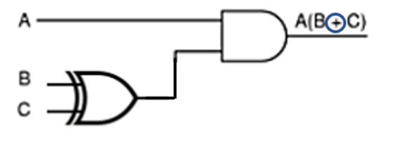
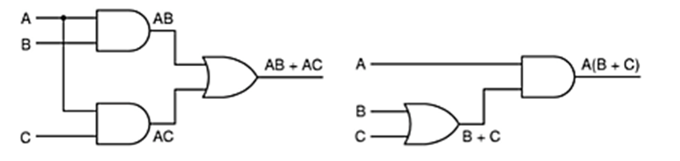

# Arquitetura de Computadores do Século XXI: Circuitos Lógicos

## Exercícios

## Questão 01 
Com relação a portas lógicas, podemos afirmar:

### Resposta:
**Todas as anteriores**, sendo elas:
- a) São componentes básicos de circuitos digitais podendo assumir o valor 0 ou 1

> SOLUÇÃO DO PROFESSOR ✨
>
> ​Por definição, cada porta lógica só pode assumir 0 ou 1.

## Questão 02 

Quanto às portas lógicas AND e OR, podemos afirmar:

### Resposta:
- b) ​A porta AND corresponde à operação de multiplicação e a porta OR corresponde à operação de soma

> SOLUÇÃO DO PROFESSOR ✨
>
> Por definição, a porta OR corresponde à soma de sinais e AND à multiplicação de sinais.

## Questão 03 

Dado o seguinte circuito:

​Indique a saída do circuito para as entradas: A=0, B=1, C =1.
​Marque a alternativa correta:

### Resposta:
- d) 0

> SOLUÇÃO DO PROFESSOR ✨
>
> ​Utilizando os valores, temos B+C=1 e depois A=0, isto é, 0(1) = 0.

## Questão 04 
Dado o seguinte circuito:

​Indique a saída do circuito para as entradas: A=1, B=0, C =1.
​Marque a alternativa correta:

### Resposta:
- a) 1

> SOLUÇÃO DO PROFESSOR ✨
>
> ​A operação na porta XOR resulta 1 pois as entradas são diferentes, como C=1, temos 1 x 1 = 1.

## Questão 05 

Considere os dois circuitos lógicos:

​Dica: observe as expressões matemáticas.
​Podemos afirmar sobre elas:

### Resposta:
- c) ​São equivalentes, pois as mesmas entradas possuem as mesmas saídas

> SOLUÇÃO DO PROFESSOR ✨
>
> Os dois circuitos possuem a mesma saída lógica uma vez que AB + AC = A(B+C), com isso são equivalentes.

## Questão 06 

​ENADE Adaptada
​Dado o seguinte circuito:

No circuito acima que possui cinco entradas: A, B, C, D e E e uma só saída representada por f(A, B, C, D, E), qual opção apresenta uma expressão lógica equivalente a essa função quando A = 1, B = 0, C = 1, D = 1, E = 0 ?

### Resposta:
- a) 1

> SOLUÇÃO DO PROFESSOR ✨
>
> ​Inserindo os sinais em todas as portas do circuito obedecendo as regras vistas em aula e no material, resulta o valor 1.