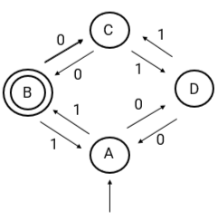

# Arquitetura de Computadores do Século XXI: Teoria da Computação

## Exercícios

## Questão 01 
A teoria da computação fornece base científica e matemática para muitos processos computacionais. Um deles é o que se refere à análise de algoritmos, o que permite a comparação entre desempenho de algoritmos que resolvem um mesmo problema. Em geral, quanto mais rápido cresce a função que representa um algoritmo em função do tamanho de entrada e o número de comparações, pior é o algoritmo

Dados quatro algoritmos (A), (B), © e (D) que resolvem um mesmo problema, sendo que: (A) algoritmo de desempenho logarítmico, (B) algoritmo de desempenho linear, © algoritmo de desempenho polinomial e (D) algoritmo de desempenho exponencial, podemos afirmar:

### Resposta:
- [x] a) ​Algoritmo A é preferível, depois na ordem, B, C e D, sendo este último o menos interessante deles
- [ ] b) Algoritmo D é preferível, depois na ordem, C, D e A, sendo este último o menos interessante deles
- [ ] c) Algoritmo B é preferível, depois na ordem A, C e D, sendo este último o menos interessante deles
- [ ] d) ​Algoritmo C é preferível, depois na ordem, B, A e D, sendo este último o menos interessante deles
- [ ] e) ​Algoritmo A é preferível, depois na ordem, D, C e B, sendo este último o menos interessante deles

> SOLUÇÃO DO PROFESSOR ✨
>
> ​Quanto mais lentamente cresce a função, mais interessante é o algoritmo uma vez que o “custo” computacional é menor. Nesse sentido, a sequência é A, B, C, D
> 
> Prof. Lumie Zanazi

## Questão 02 
A Máquina de Turing tem grande importância na Computação porque:

### Resposta:
- [ ] a) ​Ajuda a esclarecer que os computadores resolvem qualquer tipo de problema
- [ ] b) ​Estabelece qual a máxima velocidade de um computador
- [ ] c) Define os limites de usabilidade na operação de computadores
- [ ] d) ​Como a fita é infinita, não tem aplicabilidade
- [x] e) ​Ajuda a esclarecer os limites das máquinas e o significado de algoritmos

> SOLUÇÃO DO PROFESSOR ✨
>
> ​Se uma sequência de instruções pode ser executada pela máquina de Turing, é um algoritmo
> 
> Prof. Lumie Zanazi

## Questão 03 
Quanto ao algoritmo de busca sequencial, podemos afirmar:

### Resposta:
- [x] a) ​Método de busca de um elemento em uma lista em que os elementos são visitados sequencialmente até que o elemento procurado seja encontrado ou termine a lista
- [ ] b) Método em que a existência ou não de um elemento em uma lista é feita por sorteio, portanto de forma aleatória
- [ ] c) Método de busca de um elemento que necessita que a lista seja previamente ordenada
- [ ] d) ​Método de busca de um elemento em uma estrutura do tipo árvore
- [ ] e) Método de busca de um elemento bastante eficiente para listas grandes de elementos

> SOLUÇÃO DO PROFESSOR ✨
>
> ​A busca sequencial é a busca elemento a elemento da lista, fazendo comparações um a um até que seja encontrado ou não
> 
> Prof. Lumie Zanazi

## Questão 04 
Quanto ao algoritmo de busca binária tem por característica:

### Resposta:
- [ ] a) Método em que a existência ou não de um elemento em uma lista é feita por sorteio, portanto de forma aleatória
- [x] b) Método de busca eficiente de um elemento em uma lista mas só roda em listas ordenadas
- [ ] c) Método de busca de um elemento que necessita que a lista seja previamente ordenada
- [ ] d) Método de busca de um elemento em uma estrutura do tipo árvore
- [ ] e) ​Método de busca de um elemento bastante eficiente para listas grandes de elementos

> SOLUÇÃO DO PROFESSOR ✨
>
> ​A busca binária faz chamadas recursivas para si mesma, dividindo a lista por dois de forma a reduzir a busca, o problema é que só funciona para listas ordenadas
> 
> Prof. Lumie Zanazi

## Questão 05 
O Problema do Caixeiro Viajante é clássico na Computação e ajuda a compreender que alguns problemas não tem solução fácil embora sejam relativamente comuns

O Problema do Caixeiro Viajante tem solução ou complexidade:

### Resposta:
- [ ] a) ​Polinomial
- [ ] b) ​Linear
- [ ] c) ​Logarítmica
- [x] d) ​Exponencial
- [ ] e) Não definida

> SOLUÇÃO DO PROFESSOR ✨
>
> O Problema do Caixeiro Viajante envolve muitos desafios porque à medida que cresce o número de cidades, o número de combinações cresce exponencialmente
> 
> Prof. Lumie Zanazi

## Questão 06 
​(ENADE/Adaptado) Dado o autômato representado pelo diagrama de estados abaixo, qual a única cadeia de entrada que este autômato aceita? Dica: comece por onde entra a seta (estado A), o autômato “aceita” a cadeia de 0´s e 1´s se parar no estado B​

 
 ### Resposta:
- [ ] a) ​1010011
- [ ] b) ​11001100
- [ ] c) ​010101011
- [x] d) ​111011000
- [ ] e) ​11000011

> SOLUÇÃO DO PROFESSOR ✨
>
> ​Testando para todas as cadeias de valores, a única que irá parar no estado de aceitação é a 111011000
> 
> Prof. Lumie Zanazi