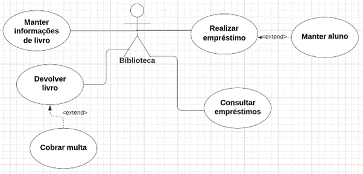

# Análise e Levantamento de Requisitos de Software: Caso de Uso e Descrição de Caso de Uso

## Exercícios

## Questão 01 
Em relação aos motivos que levam um engenheiro de software a realizar a descrição de caso de uso, seja expandida ou não expandida, analise as afirmativas:

I - Deve ser realizada para validar a compreensão;

II - Assegurar que todos os requisitos foram definidos sem inconsistências.

III - Recurso importante na composição da documentação.

IV - Serve de suporte para realizar a evolução do diagrama de caso de uso tornando os procedimentos reutilizáveis e coesos.

Marque a alternativa correta:

### Resposta:
- [ ] a) I e III estão corretas.
- [x] b) ​I, II, III e IV estão corretas.
- [ ] c) ​I e IV estão corretas.
- [ ] d) ​II e III estão corretas.
- [ ] e) II e IV estão corretas.

> SOLUÇÃO DO PROFESSOR ✨
>
> ​A letra B é a alternativa correta, pois todas as afirmativas estão corretas. Uma descrição de caso de uso é essencial para que sejam compreendidos como realizar os requisitos de sistema, buscando a completude e consistência das informações e possíveis evoluções no diagrama de caso de uso. Além disso, devemos considerar que a descrição de caso de uso irá compor a documentação e dará suporte para a equipe de desenvolvimento na implementação dos componentes.​​
>
> Prof. Carolyna Santiago

## Questão 02 
Observe o seguinte Diagrama de Caso de uso para um Sistema de Biblioteca:

Marque a alternativa que indica um caso de uso para realização de uma descrição não expandida:

a)   Consultar empréstimos.

b)   Devolver livro.

c)   Realizar empréstimo.

d)   Manter informações de livro.

e)   Manter aluno.

Gabarito comentado: A letra A é a alternativa correta, pois a descrição não expandida deve ser utilizada para casos de uso com procedimentos não complexos e poucas regras. Entende-se que “Consultar empréstimos” estará solicitando informações de seleção e apresentando uma interface com as informações de empréstimo. Os demais casos de uso envolvem regras diversas, manipulam várias informações e, “Realizar empréstimo” e “Devolver livro” possuem interação caso de uso - caso de uso.

​
### Resposta:
- [x] a) Consultar empréstimos.
- [ ] b) Devolver livro.
- [ ] c) ​Realizar empréstimo.
- [ ] d) Manter informações de livro.
- [ ] e) ​Manter aluno.

> SOLUÇÃO DO PROFESSOR ✨
>
> A letra A é a alternativa correta, pois a descrição não expandida deve ser utilizada para casos de uso com procedimentos não complexos e poucas regras. Entende-se que “Consultar empréstimos” estará solicitando informações de seleção e apresentando uma interface com as informações de empréstimo. Os demais casos de uso envolvem regras diversas, manipulam várias informações e, “Realizar empréstimo” e “Devolver livro” possuem interação caso de uso - caso de uso.
>
> Prof. Carolyna Santiago

## Questão 03 
Analise as seguintes afirmativas:

I - A descrição expandida deve ser utilizada para especificar casos de uso com poucas regras.

II - A estrutura da descrição de caso de uso não expandida não apresenta a pré-condição e pós-condição.

III - A estrutura da descrição de caso de uso não expandida é formada pela descrição em linguagem natural do procedimento, o nome e descrição sucinta do caso de uso.

Marque a alternativa correta:

### Resposta:
- [ ] a) As afirmativas I e II estão corretas.
- [ ] b) ​As afirmativas I e III estão corretas.
- [ ] c) ​As afirmativas II e III estão corretas.
- [ ] d) ​As afirmativas I, II e III estão corretas.
- [x] e) ​Somente a afirmativa I está correta.

> SOLUÇÃO DO PROFESSOR ✨
>
> ​A letra E é a alternativa correta, pois a descrição expandida deve ser utilizada para especificar casos de uso com poucas regras. As demais afirmativas não estão corretas, porque a estrutura da descrição de caso de uso não expandida apresenta nome, descrição sucinta do caso de uso, pré-condição, pós-condição e descrição em linguagem natural do procedimento.​​
>
> Prof. Carolyna Santiago

## Questão 04 
Suponha um sistema de controle de despesas e receitas, onde o usuário deve registrar as receitas mensalmente e as despesas referentes. O usuário poderá ainda consultar as despesas em ordem decrescente de valor ou crescente de data. Analise as seguintes afirmativas para a situação descrita acima:

I - A pré-condição do caso de uso “Consultar despesas” pode ser definida como: ter despesas cadastradas para mês de referência informado.

II - O caso de uso “Consultar despesas” pode ser especificado pela descrição de caso de uso não expandida.

III - A ordem de visualização das informações no caso de uso “Consultar despesas” se refere a uma regra do procedimento.

Marque a alternativa CORRETA:

### Resposta:
- [ ] a) Somente a afirmativa II está correta.
- [ ] b) ​As afirmativas I e II estão corretas.
- [ ] c) ​As afirmativas I e III estão corretas.
- [ ] d) ​As afirmativas II e III estão corretas.
- [x] e) ​As afirmativas I, II e III estão corretas.

> SOLUÇÃO DO PROFESSOR ✨
>
> ​A letra E é a alternativa correta. Todas as afirmativas estão corretas. Uma pré-condição indica condições que devem estar presentes no ambiente antes da execução do caso de uso. Desta forma, para se realizar o “Consultar despesas” é preciso que existam despesas cadastradas para o mês de referência solicitado. “Consultar despesas” pode ser descrito como não expandida, pois tem poucas regras e baixa complexidade. A ordem como as informações são apresentadas ao usuário é uma regra de atendimento do negócio, de acordo com a necessidade do usuário.
>
> Prof. Carolyna Santiago

## Questão 05 
Analise a seguinte descrição de caso de uso não expandida:

Nome: Manter animal

Descrição sucinta:  Caso de uso deve realizar as operações de inclusão, alteração e exclusão de animais da PetShop Encantada.

Pré-condição: —---

Pós-condição: informações de animal atualizadas.

DESCRIÇÃO do PROCEDIMENTO

Caso de uso deve receber a operação desejada (Inclusão, Alteração, Exclusão) e, em função da alteração, deve realizar a manutenção das informações de animal. O procedimento deverá realizar validações e apresentar mensagens de erro. A operação de alteração deve ser considerada como fluxo normal na execução. Ao final, deve ser apresentada uma mensagem de sucesso da operação.

Analise as afirmativas.

I - O procedimento descrito possui muitas regras e deveria ser especificado na descrição de caso de uso expandida.

II - Identifica-se um erro na descrição, pois a pós-condição deve ser especificada no cabeçalho.

III - A descrição de caso de uso não expandida está corretamente representada em sua estrutura.

Marque a alternativa CORRETA:

### Resposta:
- [ ] a) Somente a afirmativa I está correta.
- [ ] b) ​As afirmativas I e II estão corretas.
- [x] c) ​As afirmativas I e III estão corretas.
- [ ] d) ​As afirmativas II e III estão corretas.
- [ ] e) ​ As afirmativas I, II e III estão corretas.

> SOLUÇÃO DO PROFESSOR ✨
>
> ​A letra C é a alternativa correta, pois, pelo número de regras e procedimentos, a especificação indicada é a descrição de caso de uso expandida e a estrutura apresentada para descrição de caso de uso não expandida está correta. O item II não está correto, porque no cabeçalho as informações de pós-condição e pré-condição podem não ser informadas, os procedimentos podem não requerer nada.
>
> Prof. Carolyna Santiago

## Questão 06 
Observe o seguinte Diagrama de Caso de uso para um Sistema de Biblioteca.

Na descrição de caso de uso “Realizar empréstimos” e “Devolver livro” devemos realizar a atualização da informação do estado do livro para “Emprestado” e “Disponível”, respectivamente.  Desta forma, analisando as técnicas possíveis de evolução do caso de uso no processo de desenvolvimento do sistema, marque a alternativa que indica uma possível mudança no caso de uso:

### Resposta:
- [ ] a) Juntar os procedimentos “Realizar empréstimos” e “Devolver livro” em um único caso de uso “Manter empréstimos”.
- [ ] b) ​Estabelecer uma interação <extend> entre “Devolver livro” e “Realizar empréstimos”.
- [ ] c) ​Estabelecer uma interação <extend> entre “Realizar empréstimos” e “Devolver livro”.
- [x] d) ​Criação de um caso de uso “Atualizar livro” com interação <include> em “Realizar empréstimos” e “Devolver livro”.
- [ ] e) Criação de um caso de uso “Atualizar livro” com interação <extend> em “Realizar empréstimos” e “Devolver livro”.

> SOLUÇÃO DO PROFESSOR ✨
>
> ​A letra D é a alternativa correta, pois quando se tem um conjunto de procedimentos iguais em dois casos de uso distintos devemos criar um novo caso de uso para realizar os procedimentos comuns e estabelecer a interação <include>. Não deves juntar os casos de uso “Realizar empréstimos” e “Devolver livro”, pois esse novo caso de uso ficará extenso e não será coeso.
>
> Prof. Carolyna Santiago