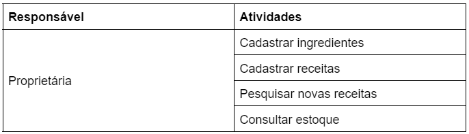

# Análise e Levantamento de Requisitos de Software: Modelagem do Processo - Construção

## Exercícios

## Questão 01 
A construção do modelo BPMN traz várias vantagens para a gestão dos processos de negócio.

Analise as afirmativas a seguir:
 
I - Os modelos BPMN provê à empresa a facilidade de gerenciar pessoas durante o desenvolvimento de um projeto.
II - A adoção dos modelos BPMN é uma decisão estratégica para se ter transparência na realização das atividades do negócio.
III - Ter modelos BPMN das atividades do negócio gera otimização, pois oferece visibilidade das interações entre os setores que as realizam.

Assinale a alternativa correta:

### Resposta:
- [ ] a) As afirmativas I, II e III estão corretas
- [ ] b) As afirmativas I e II estão corretas
- [ ] c) As afirmativas I e III estão corretas
- [x] d) As afirmativas II e III estão corretas
- [ ] e) Somente a afirmativa III está correta

> SOLUÇÃO DO PROFESSOR ✨
>
> A letra D é a alternativa correta, pois as vantagens providas pela modelagem BPMN é dar visibilidade das atividades de negócio e seus relacionamentos; facilitar a identificação de redundância nos procedimentos; agilizar a identificação das conexões e implicações entre as atividades, quando é necessário inserção de novas necessidades; tornar transparente as atividades de negócio. A afirmativa I não está correta, porque a gestão de pessoas não é realizada pelo modelo BPMN, e sim pela gestão das atividades.
>
> Prof. Ricardo Monteiro

## Questão 02 
São utilizadas 3 etapas básicas na construção do modelo BPMN.

Marque a alternativa que descreve a etapa: “Identificação de elementos de fluxo”.
### Resposta:
- [ ] a) Etapa que busca conhecer os procedimentos executados na realização do negócio em estudo.
- [x] b) Etapa que analisa cada atividade identificando sua representação sequencial, temporal ou condicional, no contexto de realização do negócio.
- [ ] c) ​Etapa utilizada para definir as atividades que terão uso da tecnologia.
- [ ] d) ​Etapa de utilização da simbologia e montagem do modelo.
- [ ] e) Etapa de definição das atividades e os responsáveis por realizá-las.

> SOLUÇÃO DO PROFESSOR ✨
>
> A letra B é a alternativa correta, pois na etapa de identificação de elementos de fluxo é identificado qual o comportamento da atividade em sua realização, podendo ser sequencial, quando ocorrer junto a outra atividade, paralela quando puder acontecer ao mesmo tempo, sem dependência ou ainda tiver que ser realizada após um tempo. A etapa de definição das atividades/procedimentos e os responsáveis por realizá-las é a de Identificação de atividades. A etapa que utiliza a simbologia para montagem do modelo é a Construção de modelo BPMN e, não temos etapa para identificar as atividades que terão uso da tecnologia. Essa identificação é feita em um próximo momento quando se estuda o modelo construído. As atividades inseridas no modelo devem ser consideradas independente do uso da tecnologia.
>
> Prof. Carolyna Santiago

## Questão 03 
Suponha um negócio relacionado a venda de picolés que possui as  atividades/responsáveis relacionadas na Tabela 4.​

Sabe-se que na análise de representação da atividade no contexto de negócio, deve-se identificar a primeira atividade a ser desenvolvida, para iniciar o modelo BPMN.

Marque a alternativa que indica a primeira atividade a ser representada no modelo BPMN para o negócio de Vendas de Picolés.

### Resposta:
- [x] a) Cadastrar picolés.
- [ ] b) ​Cadastrar cliente.
- [ ] c) ​Registrar venda.
- [ ] d) ​Pagar comissão.
- [ ] e) ​Consultar estoque.

> SOLUÇÃO DO PROFESSOR ✨
>
> ​A letra A é a alternativa correta, pois toda representação do modelo BPMN deve iniciar pelas informações de base do negócio que, no caso, são os picolés. O “Cadastrar cliente” só irá acontecer a partir do “Registrar venda”, caso os dados do cliente não estejam já cadastrados. “Pagar comissão” é uma atividade de fim de ciclo de venda e, “Consultar estoque” precisa ter os picolés cadastrados.
>
> Prof. Carolyna Santiago

## Questão 04 
Dentre as simbologias propostas pelo modelo BPMN, as RAIAS são utilizadas para:

### Resposta:
- [ ] a) Representar atividades que são realizadas após alguma marcação temporal.
- [x] b) Representar os responsáveis por realizar as atividades relacionadas em seu box.
- [ ] c) ​Representar atividades que dependem de uma condição.
- [ ] d) Representar atividades que podem ser realizadas ao mesmo tempo, de forma independente.
- [ ] e) Representar atividades que são realizadas sequencialmente.

> SOLUÇÃO DO PROFESSOR ✨
>
> A letra B é a alternativa correta, pois a RAIA representa os responsáveis por realizar as atividades relacionadas a eles em seu box. A letra A é representada pelo evento intermediário de tempo; a letra C é a simbologia que representa uma condição para realização de uma atividade; a letra D indica a representação do evento paralelo e a letra E são atividades realizadas de forma sequencial, sem interrupção ou condição.
>
> Prof. Carolyna Santiago

## Questão 05 
O modelo BPMN apresenta um conjunto de simbologias para representação de eventos das atividades, sendo as principais: condicional, paralelo e temporal.

Marque a alternativa que descreve uma situação que indica a utilização condicional:

### Resposta:
- [ ] a) O proprietário de um estabelecimento todo final do mês realiza o levantamento de seu faturamento e apura seu lucro.
- [ ] b) ​O paciente da clínica XYZ recebe no final do ano uma mensagem de felicitações de natal.
- [x] c) Na quitanda do Sr. Manoel os clientes são cadastrados sempre que compram qualquer mercadoria pela primeira vez.
- [ ] d) ​Os alunos da Descomplica realizam no final da live semanal uma avaliação de realização da mesma.
- [ ] e) ​Os alunos de uma universidade, quando realizam sua matrícula, recebem um email de confirmação com o número de seu registro acadêmico.

> SOLUÇÃO DO PROFESSOR ✨
>
> ​A letra C é a alternativa correta, pois “Cadastrar cliente” é uma atividade que só acontece se for a primeira vez, o que descreve a condicional.
>
> Prof. Carolyna Santiago

## Questão 06 
Uma loja de doces mantém suas receitas e ingredientes catalogados para consulta do cozinheiro, sempre que necessário. A loja registra todos os ingredientes e, a partir deles, monta as receitas. A proprietária a qualquer momento pesquisa novas receitas e também pode consultar o estoque.

Analise a lista de atividades/responsáveis relacionadas na Tabela 5.

Marque a alternativa que indica atividades que podem ser representadas em paralelo:

### Resposta:
- [ ] a) Cadastrar ingredientes e Cadastrar receitas.
- [ ] b) ​Pesquisar novas receitas e Cadastrar receitas.
- [ ] c) ​Consultar estoque e Cadastrar ingredientes.
- [ ] d) Pesquisar novas receitas e Cadastrar ingrediente.
- [x] e) ​Pesquisar novas receitas e consultar estoque.

> SOLUÇÃO DO PROFESSOR ✨
>
> ​A letra E é a alternativa correta, pois “Pesquisar novas receitas” e “Consultar estoque” são atividades que podem ser realizadas a qualquer momento e não possuem dependência na execução.
>
> Prof. Carolyna Santiago