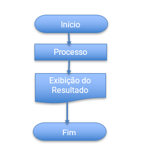

# Criação de Aplicações e Sistemas: Introdução a Algoritmos

## Exercícios

## Questão 01 
Leia o trecho a seguir:
“Se você procurar no dicionário, vai achar alguma definição genérica para a palavra ‘algoritmo’. Pode ser algo assim: ‘Qualquer método utilizado para a solução de determinado problema.’ Convenhamos, esta definição não diz muita coisa. Precisamos de algo mais preciso. Uma definição melhor para algoritmos poderia ser: ‘Uma sequência ordenada e sem ambiguidade de passos para a resolução de um problema.’ O que isto quer dizer? Vamos analisar as palavras da definição. Primeiro, foi dito que um algoritmo deve ser uma ‘sequência ordenada … de passos’. Cada passo deve contribuir para chegar mais perto da solução final de um problema, ou seja, cada passo deve avançar em direção à solução. Em suma, cada passo deve ser efetivo. Também foi dito que esses passos devem ser ‘sem ambiguidades’. Não deve haver dúvidas sobre o que cada passo significa para a resolução do problema.”

Fonte: RIBEIRO, J. A. Introdução à programação e aos algoritmos. 1. ed. Rio de Janeiro: LTC, 2019, p. 40.

Com base no texto acima e nos conteúdos abordados sobre Algoritmos, analise o esquema abaixo:
​
Esse esquema é classificado como:

### Resposta:
- [ ] a) Fluxograma
- [ ] b) Pseudocódigo
- [ ] c) Diagrama de Chapin
- [ ] d) Algoritmo descritivo
- [ ] e) Algoritmo em Português Estruturado

> SOLUÇÃO DO PROFESSOR ✨
>
> ​O fluxograma consiste numa ferramenta usada e desenvolvida pelos profissionais de análise de sistemas, bem como, por alguns profissionais de Organização, Sistemas e Métodos; que tem como objetivo de descrever um fluxo, seja ele manual ou mecânico, especificando os suportes usados para os dados e as informações​
>
> Prof. Ricardo Monteiro

## Questão 02 
Leia os textos a seguir:

Texto 1
“Leia cada palavra do dicionário até encontrar a palavra procurada ou não restarem mais palavras a serem lidas. Se encontrar a palavra, imprima seu significado.”

Fonte: RIBEIRO, J. A. Introdução à programação e aos algoritmos. 1. ed. Rio de Janeiro: LTC, 2019, p. 43.

Texto 2
“Passo 1: Leia a primeira palavra do dicionário.
Passo 2: Se for a palavra procurada, imprima a definição e termine.
Passo 3: Se for a última palavra, imprima “Palavra não existe” e termine.
Passo 4: Leia a próxima palavra.
Passo 5: Volte para o passo 2.”

Fonte: RIBEIRO, J. A. Introdução à programação e aos algoritmos. 1. ed. Rio de Janeiro: LTC, 2019, p. 43.

A professora Débora propôs à turma a seguinte tarefa: Escreva um algoritmo para ensinar um computador como achar uma palavra no dicionário. O texto 1 mostra a resposta de João e o texto 2 exibe a resposta de Tatiana. Com base nos textos e nos conteúdos abordados sobre Algoritmos, é correto afirmar que:

### Resposta:
- [ ] a) O texto 1 é um algoritmo, pois tem detalhes suficientes para poder ser traduzido em uma linguagem de programação. O texto 2 não é um algoritmo, porque os computadores possuem inteligência própria já sabem como se organiza um dicionário
- [x] b) O texto 2 é um algoritmo (escrito em linguagem natural), pois tem detalhes suficientes para poder ser traduzido em uma linguagem de programação. O texto 1 é apenas uma ideia em forma de texto livre, não possui passos definidos, sendo assim, não se caracteriza como um algoritmo
- [ ] c) O texto 2 não é um algoritmo, pois não tem detalhes suficientes para poder ser traduzido em uma linguagem de programação. O texto 1 é um algoritmo, porque os computadores possuem inteligência suficiente para, a partir da frase, identificar o significado de uma palavra no dicionário
- [ ] d) O texto 1 e 2 são algoritmos, pois ambos têm detalhes suficientes para serem traduzidos em uma linguagem de programação
- [ ] e) O texto 1 e 2 não são algoritmos, pois ambos não fornecem informações suficientes para que um computador seja capaz de procurar o significado de uma palavra no dicionário

> SOLUÇÃO DO PROFESSOR ✨
>
> ​Os computadores são bons em executar tarefas repetitivas, mas temos que lembrar que eles não possuem inteligência própria, de modo que é preciso criar padrão de comportamento e, em seguida, especificar esse padrão de modo que o computador possa executá-lo. Logo, computadores por si só não sabem como se organiza um dicionário e precisamos ensiná-lo. Com isso, o texto 1 não é tido como um algoritmo, pois consiste numa solução em prosa, sem se ater aos detalhes necessários para implementar uma linguagem de programação. Já o texto 2 é tido como um algoritmo, pois expressa uma solução detalhada e simplificada que pode ser adaptada para a linguagem computacional
>
> Prof. Ricardo Monteiro

## Questão 03 
“Ada Lovelace é considerada a primeira pessoa que escreveu um algoritmo para ser processado por máquina. Nascida em 1815, trabalhou com Charles Babbage quando este estava desenvolvendo a sua máquina analítica, uma das primeiras ideias de construção de computadores. Entre os anos de 1842 e 1843, Ada escreveu o que é considerado o primeiro algoritmo computacional, descrevendo como calcular a Sequência de Bernoulli por intermédio da máquina desenvolvida por Babbage. Infelizmente, a máquina de Babbage não chegou a ser construída no decorrer de sua vida.”

Fonte: RIBEIRO, J. A. Introdução à programação e aos algoritmos. 1. ed. Rio de Janeiro: LTC, 2019, p. 43

A partir do texto acima e dos conhecimentos sobre Algoritmos, analise as asserções a seguir e a relação proposta entre elas:

I. O algoritmo ilustra uma série de etapas em uma ordem específica, seguindo o raciocínio lógico

Porque

II. A partir do algoritmo, descrito em linguagem natural, pode-se construir um fluxograma, composto por símbolos que representam os passos deste algoritmo, ou seja, o tipo de ação a ser executada

### Resposta:
- [ ] a) As asserções I e II são proposições verdadeiras, e a II é uma justificativa correta da I
- [ ] b) ​A asserção I é uma proposição verdadeira, e a II é uma proposição falsa
- [ ] c) ​As asserções I e II são proposições falsas
- [x] d) As asserções I e II são proposições verdadeiras, mas a II não é uma justificativa correta da I​
- [ ] e) A asserção I é uma proposição falsa, e a II é uma proposição verdadeira

> SOLUÇÃO DO PROFESSOR ✨
>
> ​A assertiva I está correta, visto que o algoritmo apresenta uma série de passos em uma ordem específica, seguindo o raciocínio lógico, em que cada um deles é representado por uma instrução ou sentença, com o objetivo de realizar um processo ou tomar uma decisão. A assertiva II é verdadeira, mas não é uma justificativa correta da I, pois “A partir do algoritmo, descrito em linguagem natural, pode-se construir um fluxograma…” não é o porquê da assertiva I, visto que ambas assertivas falam da mesma coisa, representações de algoritmos
>
> Prof. Ricardo Monteiro

## Questão 04 
Leia o trecho a seguir:
“Fluxogramas funcionam bem para demonstrar uma versão mais abstrata e menos detalhada de um algoritmo. Servem como ilustração gráfica da solução […] Hoje em dia preferimos usar algo mais próximo do código das linguagens de programação. Esta linguagem é tanto mais próxima do código final quanto quisermos. Como não tem a obrigação de ser compreensível pelo computador, chamamos isso de pseudocódigo.”

Fonte: RIBEIRO, J. A. Introdução à programação e aos algoritmos. 1. ed. Rio de Janeiro: LTC, 2019, p. 47.

Com base nessas informações e no conteúdo estudado acerca dos Fluxogramas, analise os símbolos abaixo e associe-os com o tipo de operação que descrevem.

( )Saída de dados em impressora
( ) Decisão
( ) Atribuição e chamada ou retorno de subalgoritmo
( ) Entrada de dados

Agora, assinale a alternativa que apresenta a sequência correta:

### Resposta:
- [ ] a) 4, 3, 2, 1
- [ ] b) 1, 2, 3, 4
- [ ] c) 3, 1, 2, 4
- [ ] d) 2, 4, 1, 3
- [x] e) ​4, 2, 3, 1

> SOLUÇÃO DO PROFESSOR ✨
>
> ​O símbolo (1) indica a operação “entrada de dados”, o símbolo (2) representa “decisão”, o símbolo (3) expressa a operação de “atribuição e chamada ou retorno de subalgoritmo” e, por fim, o símbolo (4) significa a operação de “saída de dados em impressora.”
>
> Prof. Ricardo Monteiro

## Questão 05 
(CESPE/ CEBRASPE - Adaptada) Leia o trecho a seguir:

Na escola Nossa Casa, utiliza-se um algoritmo para o cálculo da média de determinado aluno utilizando a fórmula média = (P1 + P2) / 2, em que P1 e P2 referem-se, respectivamente, às notas do aluno na primeira e na segunda prova. A média mínima necessária para que o aluno seja aprovado numa disciplina é 6.

A partir do texto acima e dos conhecimentos sobre Algoritmos, considere a afirmativas a seguir:

I. Douglas obteve nota 6,0 na primeira prova e 5,0 na segunda, portanto, ele será aprovado.

II. Juliana obteve nota 4,0 na primeira prova e 7,0 na segunda, portanto, ela será aprovada.

III. José obteve nota 2,0 na primeira prova e 8,0 na segunda, portanto, ele será reprovado.

IV. Karina obteve nota 5,0 na primeira prova e 6,0 na segunda, portanto, ela será reprovada.

Está correto o que se afirma em:
### Resposta:
- [ ] a) II, III e IV
- [ ] b) I e III
- [ ] c) II e IV
- [x] d) III e IV
- [ ] e) I, II e III

> SOLUÇÃO DO PROFESSOR ✨
>
> De acordo com o algoritmo fórmula média = (P1 + P2) / 2. Logo, a assertiva I está incorreta, pois Douglas obteve média 5.5, sendo reprovado; a assertiva II está incorreta, porque Juliana obteve média 5.5, sendo reprovada; a assertiva III está correta, visto que José alcançou média 5.0, sendo reprovado; a assertiva IV está correta, uma vez que Karina alcançou média 5.5, sendo reprovada.
>
> Prof. Ricardo Monteiro

## Questão 06 
Leia o trecho a seguir:

"Quando for pensar em uma solução algorítmica para um problema, comece com uma ideia bem abstrata e, aos poucos, aproxime sua ideia do que um computador pode fazer, auxiliado por uma linguagem de programação. Somente quando o algoritmo tiver detalhamento suficiente, implemente-o com uma linguagem de programação.”

Fonte: RIBEIRO, J. A. Introdução à programação e aos algoritmos. 1. ed. Rio de Janeiro: LTC, 2019, p. 45.

A partir do texto acima e do conhecimento sobre Algoritmos, assinale abaixo como se chama a estratégia utilizada para a construção de algoritmos que consiste em dividir o problema em problemas menores, até que cada parte seja pequena o bastante para que a solução seja encontrada.

### Resposta:
- [ ] a) soma
- [x] b) decomposição
- [ ] c) multiplicação
- [ ] d) qualificação
- [ ] e) equação

> SOLUÇÃO DO PROFESSOR ✨
>
> A técnica de quebrar o problema em partes menores é conhecida como decomposição ou refinamento
>
> Prof. Ricardo Monteiro