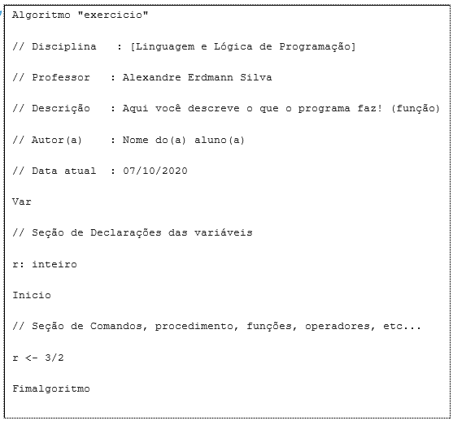

# Criação de Aplicações e Sistemas: Variáveis e Constantes

## Exercícios

## Questão 01 
Leia o trecho a seguir:
"Imagine que a memória principal de um computador é um arquivo com muitas gavetas, e cada uma delas pode armazenar apenas um valor por vez, seja um dado inteiro, real, lógico ou caractere [literal]. Por ser um arquivo com várias gavetas, é necessário que cada uma das gavetas seja identificada com um nome, portanto o valor armazenado pode ser utilizado a qualquer momento.”

Fonte: MANZANO, J. A. N. G.; OLIVEIRA, J. F. Estudo Dirigido de Algoritmos. 15. ed. São Paulo: Érica, 2012, p. 40.

A partir do texto acima e dos conhecimentos sobre Variáveis e Constantes, analise a figura a seguir:

Figura 1 - Arquivo de gavetas identificadas por etiquetas representando a memória de um computador | Fonte: MANZANO, J. A. N. G.; OLIVEIRA, J. F. Estudo Dirigido de Algoritmos. 15. ed. São Paulo: Érica, 2012, p. 40
Figura 1 - Arquivo de gavetas identificadas por etiquetas representando a memória de um computador | Fonte: MANZANO, J. A. N. G.; OLIVEIRA, J. F. Estudo Dirigido de Algoritmos. 15. ed. São Paulo: Érica, 2012, p. 40

Essa analogia explica corretamente a definição de:

### Resposta:
- [ ] a) ​Constante
- [ ] b) ​Valor
- [x] c) ​Variável
- [ ] d) ​Operadores aritméticos
- [ ] e) ​Operadores lógicos

> SOLUÇÃO DO PROFESSOR ✨
>
> ​Letra C. Para cada variável, é reservado um espaço na memória do computador (a gaveta da analogia) para armazenar seu valor. Toda variável possui um nome (a etiqueta da gaveta descrita na analogia) utilizado para sua identificação e representação dentro de um programa de computador​

Prof. Ricardo Monteiro

## Questão 02 
​Leia o texto a seguir:
​Um estudante estava desenvolvendo o algoritmo em pseudocódigo mostrado abaixo:​

​Ao executar o programa no Visualg, o desenvolvedor tentou representar a expressão r=3/2. Entretanto, em sua tela apareceu a seguinte mensagem:​

​A explicação correta para que essa mensagem tenha sido gerada é:

### Resposta:
- [ ] a) ​A variável r está declarada como um valor real e, para obter r=3/2 ela teria que ser declarada como um valor inteiro
- [ ] b) ​A variável r está declarada como um valor real e, para obter r=3/2 ela teria que ser declarada como um valor literal
- [ ] c) ​A variável r está declarada como um valor inteiro e, para obter r=3/2 ela teria que ser declarada como um valor literal
- [x] d) ​A variável r está declarada como um valor inteiro e, para obter r=3/2 ela teria que ser declarada como um valor real
- [ ] e) ​A variável r está declarada como um valor inteiro e, para obter r=3/2 ela teria que ser declarada como um valor lógico

> SOLUÇÃO DO PROFESSOR ✨
>
> Letra D. Por definição, são inteiros os dados numéricos positivos e negativos pertencentes ao conjunto de números inteiros, excluindo qualquer valor numérico fracionário. Porém, o estudante estava buscando r igual a 3/2, um valor pertencente ao conjunto de números reais. Desse modo, r deve ser declarado como um dado numérico real, que abarga todos os números positivos e negativos, incluindo os valores fracionários e inteiros

Prof. Ricardo Monteiro

## Questão 03 
Leia o trecho a seguir:
“Variável é tudo que está sujeito a variações, que é incerto, instável ou inconstante […] O nome de uma variável é utilizado para sua identificação e representação dentro de um programa de computador.”

Fonte: MANZANO, J. A. N. G.; OLIVEIRA, J. F. Estudo Dirigido de Algoritmos. 15. ed. São Paulo: Érica, 2012, p. 41.

Com base no conhecimento acerca de Variáveis, analise as afirmativas a seguir e assinale V para a(s) verdadeira(s) e F para a(s) falsa(s).

I. ( ) São nomes válidos de variáveis: nome_usuario, nomeusuario, f1, f_1, x, delta25.

II. ( ) O primeiro caractere de identificação do nome de uma variável pode ser um símbolo gráfico (por exemplo: cifrão, vírgula, ponto e vírgula, traço, parênteses, chaves, colchetes).

III. ( ) Caso deseje separar nomes compostos, deve ser utilizado o caractere de separação “*” asterisco.

IV. ( ) Não pode ser utilizado como nome de variável algum rótulo que seja uma palavra reservada ou mesmo nome de outra variável.

V. ( ) São nomes inválidos de variáveis: nome usuário, fone#, 1x, aluno*2, dia/mes, 25_delta, 5ano3.

Agora, assinale a alternativa que apresenta a sequência correta:
### Resposta:
- [ ] a) ​F, V, V, V, F
- [x] b) ​V, F, F, V, V
- [ ] c) ​V, F, V, F, V
- [ ] d) ​F, V, F, V, F
- [ ] e) ​F, V, V, F, F

> SOLUÇÃO DO PROFESSOR ✨
>
> ​Letra B. A afirmativa I é verdadeira, pois os nomes de variáveis nome_usuário, nomeusuário, f1, f_1, x, delta25 são todos válidos, visto que o primeiro caractere de identificação dos nomes são alfabéticos e os demais são formados por números, letras e sublinhado “”. A afirmativa II é falsa, pois o primeiro caractere de identificação do nome de uma variável não pode ser, em hipótese nenhuma, um caractere numérico ou um caractere de símbolo gráfico (cifrão, vírgula, ponto e vírgula, traço, parênteses, chaves, colchetes, dentre outros). A afirmativa III é falsa, visto que caso se deseje separar nomes compostos, deve ser utilizado o caractere de separação “” underline e nunca asterisco “”. A afirmativa IV é verdadeira, porque um nome uma vez utilizado torna-se exclusivo no programa em que foi definido e as palavras reservadas não podem ser usadas para outro fim. O mesmo vale para palavras como inteiro, real e lógico que são inválidas para nomes de variáveis porque são consideradas também como palavras reservadas do algoritmo ou programa. Por fim, a afirmativa V é verdadeira, porque definições como nome usuário, 1x, fone#, aluno2, dia/mes, 25_delta e 5ano3 são inválidas por conterem espaço entre palavras, por não terem uma letra como primeiro caractere e utilizarem símbolos ao invés de caracteres alfa-numéricos nas demais posições​

Prof. Ricardo Monteiro

## Questão 04 
Leia o trecho a seguir:
“Do ponto de vista computacional, semelhante ao conceito matemático ou científico, uma constante é uma grandeza numérica fixa, utilizada normalmente numa expressão aritmética ou matemática, a qual define um valor que será inalterado na expressão, independentemente das variáveis envolvidas na operação a ser realizada.”

Fonte: MANZANO, J. A. N. G.; OLIVEIRA, J. F. Estudo Dirigido de Algoritmos. 15. ed. São Paulo: Érica, 2012, p. 43.

Com base no texto acima e nos conteúdos abordados sobre Variáveis e Constantes, analise as asserções a seguir e a relação proposta entre elas:

I. A forma correta de atribuir o valor 8 em uma variável chamada resultado é resultado <- 8.

Porque

II. O comando correto para atribuir um valor a uma variável é variável <- valor.
### Resposta:
- [ ] a) ​As asserções I e II são proposições verdadeiras, mas a II não é uma justificativa correta da I
- [ ] b) ​A asserção I é uma proposição verdadeira, e a II é uma proposição falsa
- [ ] c) ​A asserção I é uma proposição falsa, e a II é uma proposição verdadeira
- [ ] d) ​As asserções I e II são proposições falsas
- [x] e) As asserções I e II são proposições verdadeiras, e a II é uma justificativa correta da I

> SOLUÇÃO DO PROFESSOR ✨
>
> ​Letra E. A assertiva I é verdadeira, pois as expressões aritméticas em computação são escritas de modo um pouco diferente da forma conhecida em matemática. Logo, para atribuir um valor para uma variável é necessário utilizar o símbolo <- (seta para a esquerda). A assertiva II é verdadeira, e é uma justificativa correta da I, porque, embora possa ocorrer variações de acordo com a linguagem de programação utilizada, utiliza-se a seta <- entre o nome da variável e o valor, tanto nos diagramas de blocos como nos códigos escritos em português estruturado.​

Prof. Ricardo Monteiro

## Questão 05 
Leia o trecho a seguir:
“Uma operação muito comum em programação de computadores é a expressão aritmética para estabelecer processamentos matemáticos. Define-se expressão aritmética como o relacionamento existente entre variáveis e constantes numéricas com a utilização dos operadores aritméticos.”

Fonte: MANZANO, J. A. N. G.; OLIVEIRA, J. F. Estudo Dirigido de Algoritmos. 15. ed. São Paulo: Érica, 2012, p. 44.

Com base no texto acima e nos conteúdos abordados sobre Operadores, considere a afirmativas a seguir:

I. O operador relacional utilizado para verificar se a variável A é maior do que a variável B é A > B

II. A representação da expressão aritmética X =43x55 (em pseudocódigo) é: X <- 43*55

III. O operador relacional utilizado para verificar se a variável D é menor ou igual a variável C é D <= C

IV. O operador relacional utilizado para verificar se a variável F é diferente da variável G é F<>G

V. A representação da expressão aritmética Y = 34+5x8 é: Y <- 34+5

Está correto o que se afirma em:
### Resposta:
- [x] a) ​I, II, III e IV
- [ ] b) ​II, III e V
- [ ] c) ​I, III, IV e V
- [ ] d) ​III e IV
- [ ] e) ​II, III, IV e V

> SOLUÇÃO DO PROFESSOR ✨
>
> Letra A. A assertiva I está correta porque, para verificar se a variável A é maior do que a variável B, utilizamos o símbolo >, de modo que a representação fica A > B. A assertiva II está correta, pois a expressão aritmética X =43x55 pode ser escrita na forma computacional como X <- 43x55 ou X <- 43*55. A assertiva III está correta, pois para verificar se uma variável é menor ou igual que outra utilizamos o símbolo <=, dessa forma temos que D<=C . A assertiva IV está correta porque para verificar se duas variáveis são diferentes utilizamos o símbolo <>, dessa forma temos F<>G . Por fim, a assertiva V está incorreta, pois a expressão aritmética Y=34+5x8 pode ser escrita na forma computacional como é: Y <- 34+5*8.​

Prof. Ricardo Monteiro

## Questão 06 
(COPS-UEL - Adaptada) Com base no conhecimento acerca das Variáveis e Constante, bem como dos operadores, analise as afirmativas a seguir e assinale V para a(s) verdadeira(s) e F para a(s) falsa(s).

I. ( ) O operador lógico “OU” é utilizado quando dois ou mais relacionamentos lógicos de uma determinada condição necessitam ser verdadeiros.

II. ( ) O operador lógico “NÃO” é utilizado quando pelo menos um dos relacionamentos lógicos de uma condição necessita ser verdadeiro.

III. ( ) Uma variável é uma posição de memória usada para guardar um valor.

IV. ( ) Os operadores aritméticos unários são utilizados em operações matemáticas de radiciação, exponenciação, divisão, multiplicação, adição e subtração; enquanto os binários promovem a inversão do estado de um valor numérico.

V. ( ) Constantes são valores fixos que um programa não pode alterar.

Agora, assinale a alternativa que apresenta a sequência correta:
### Resposta:
- [ ] a) ​F, V, V, F, F
- [ ] b) ​V, F, F, F, V
- [ ] c) ​V, V, F, V, V
- [ ] d) ​F, F, F, V, F
- [x] e) ​F, F, V, F, V

> SOLUÇÃO DO PROFESSOR ✨
>
> ​Letra E. A afirmativa I é falsa porque o operador ou faz com que seja executada uma determinada operação se pelo menos uma das condições mencionadas for verdadeira. A afirmativa II é falsa, pois o operador lógico não é utilizado quando se necessita estabelecer que uma determinada condição deve ser oposta, ou seja, uma negação. A afirmativa III é verdadeira porque, do ponto de vista computacional, pode-se definir de forma bem simplista que uma variável é a representação de uma região de memória utilizada para armazenar um determinado valor por um espaço de tempo. A afirmativa IV é falsa porque os operadores aritméticos se classificam em duas categorias, sendo binários ou unários. São binários quando utilizados em operações matemáticas de radiciação, exponenciação, divisão, multiplicação, adição e subtração; e unários quando atuam na inversão do estado de um valor numérico, que pode passar de positivo para negativo ou de negativo para positivo. A afirmativa V é verdadeira porque tudo que é fixo, estável, inalterável, contínuo, invariável e de valor fixo é considerado constante​

Prof. Ricardo Monteiro