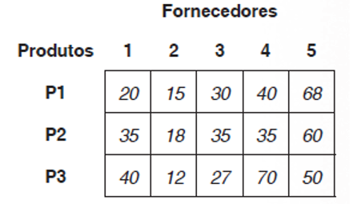

# Criação de Aplicações e Sistemas: Matriz

## Exercícios

## Questão 01 
Qual é o valor contido na posição da matriz m[2,1]?
### Resposta:
- [ ] a) 200
- [ ] b) 30
- [x] c) 180
- [ ] d) 690
- [ ] e) 100

> SOLUÇÃO DO PROFESSOR ✨
>
> Letra C. Para acessar um valor na matriz, é necessário indicar exatamente o índice correspondente entre colchetes após o nome da matriz m[2,1] então o valor contido na posição da linha 2 e coluna 1 é o 180.

Prof. Ricardo Monteiro

## Questão 02 
Leia o texto a seguir:
“Uma matriz é uma generalização do conceito de vetor. Enquanto o vetor possui apenas um índice, ou seja, apenas uma dimensão, chamado, portanto, de unidimensional, a matriz pode conter múltiplas dimensões.”

Fonte: RIBEIRO, J. A. Introdução à programação e aos algoritmos. 1. ed. Rio de Janeiro: LTC, 2019, p. 162.

Com base no texto acima e nos conteúdos abordados sobre Matrizes, analise as asserções a seguir e a relação proposta entre elas:

I. A forma correta de atribuir o valor 16 na posição [5,2] de uma matriz chamada aula é utilizando o comando aula[5,2] <- 16.

Porque

II. O comando que apresenta corretamente o elemento da posição [5,2] da matriz de nome aula é escreval(aula[5,2]).
### Resposta:
- [ ] a) As asserções I e II são proposições falsas
- [ ] b) A asserção I é uma proposição verdadeira, e a II é uma proposição falsa
- [ ] c) A asserção I é uma proposição falsa, e a II é uma proposição verdadeira
- [x] d) As asserções I e II são proposições verdadeiras, mas a II não é uma justificativa correta da I
- [ ] e) As asserções I e II são proposições verdadeiras, e a II é uma justificativa correta da I

> SOLUÇÃO DO PROFESSOR ✨
>
> ​Letra D. A assertiva I é verdadeira, visto que para escrever em um determinado valor da matriz é necessário apresentar o nome da variável e índice entre colchetes, assim a resposta correta é aula[5,2] <- 16. Veja um exemplo de aplicação no Visualg na figura a seguir:​

​A assertiva II é verdadeira, mas não é uma justificativa correta da I, pois para escrever um elemento específico como solicitado deve-se indicar os índices por meio de colchetes. Veja um exemplo de aplicação no Visualg na figura a seguir:​

Prof. Ricardo Monteiro

## Questão 03 
​Letra D. A assertiva I é verdadeira, visto que para escrever em um determinado valor da matriz é necessário apresentar o nome da variável e índice entre colchetes, assim a resposta correta é aula[5,2] <- 16. Veja um exemplo de aplicação no Visualg na figura a seguir:​

​A assertiva II é verdadeira, mas não é uma justificativa correta da I, pois para escrever um elemento específico como solicitado deve-se indicar os índices por meio de colchetes. Veja um exemplo de aplicação no Visualg na figura a seguir:​

Prof. Ricardo Monteiro
### Resposta:
- [ ] a) ​4, 3, 2, 1
- [ ] b) ​1, 2, 3, 4
- [x] c) ​3, 2, 4, 1
- [ ] d) ​2, 4, 1, 3
- [ ] e) ​4, 2, 3, 1

> SOLUÇÃO DO PROFESSOR ✨
>
> Letra C. O desenho (1) mostra uma matriz 2 x 3, o desenho (2) representa uma matriz 4 x 1, o desenho (3) expressa uma matriz 1 x 4 e, por fim, o desenho (4) mostra uma matriz 2 x 2

Prof. Ricardo Monteiro

## Questão 04 
(Quadrix - Adaptada) Leia o trecho a seguir:

Dada uma declaração de matriz de duas dimensões e uma atribuição:

(1) declarar M[5,4] : literal
(2) M[4,3]￩"ABC"

A literal “ABC” foi armazenada na posição representada pelas dimensões linha e coluna:
### Resposta:
- [x] a) ​4 e 3
- [ ] b) ​3 e 4
- [ ] c) 5 e 4
- [ ] d) ​4 e 5
- [ ] e) ​5 e 3

> SOLUÇÃO DO PROFESSOR ✨
>
> ​Letra A. A literal “ABC” foi armazenada na posição [4, 3], portanto, caracteriza-se pelas dimensões linha e coluna 4 e 3​

Prof. Ricardo Monteiro

## Questão 05 
Leia o trecho a seguir:
“A matriz de uma dimensão (vetor) é a forma mais simples de tabela de valores com apenas uma coluna e várias linhas de dados, definida em uma única variável com tamanho específico.”

Fonte: MANZANO, J. A. N. G.; OLIVEIRA, J. F. Estudo Dirigido de Algoritmos. 15. ed. São Paulo: Érica, 2012, p. 107.

Com base no conhecimento acerca de Variáveis, analise as afirmativas a seguir e assinale V para a(s) verdadeira(s) e F para a(s) falsa(s).

I. ( ) Os elementos de uma matriz podem ser de tipos de dados distintos.
II. ( ) As matrizes são referenciadas através de suas dimensões na seguinte ordem: conjunto e linhas.
III. ( ) A dimensão de uma matriz é formada por constantes inteiras e positivas.
IV. ( ) Os nomes dados a uma variável composta (matriz) seguem as mesmas regras dos nomes dados a variáveis simples.
Agora, assinale a alternativa que apresenta a sequência correta:
### Resposta:
- [ ] a) ​V, F, F, F
- [ ] b) ​V, V, V, V
- [ ] c) ​F, V, F, F
- [ ] d) ​F, F, V, F
- [x] e) ​F, F, V, V

> SOLUÇÃO DO PROFESSOR ✨
>
> ​Letra E. A afirmativa I é falsa, pois as matrizes são tabelas em memória com dados de um mesmo tipo, que podem ser “construídos” à medida que se fazem necessários. A afirmativa II é falsa, pois as matrizes são referenciadas através de suas dimensões através da quantidade de linhas e colunas. A afirmativa III é verdadeira, visto que a dimensão de uma matriz não pode ser constituída por números fracionários, decimais e nem negativos, apenas inteiros positivos. Por fim, a afirmativa IV é verdadeira porque uma matriz é um conjunto de variáveis do mesmo tipo, por isso para nomeá-la devem ser seguidas as mesmas regras dos nomes dados a variáveis simples.​

Prof. Ricardo Monteiro

## Questão 06 
Leia o trecho a seguir:
O gerente de uma loja de produtos de construção civil deseja fazer vários orçamentos a fim de averiguar o custo de uma compra de materiais para abastecer o estoque. Os três produtos P1, P2 e P3 são necessários nas quantidades Q1, Q2 e Q3, respectivamente. Ao pesquisar em cinco fornecedores, o gerente encontrou a tabela de preços apresentada na figura a seguir.

Figura 1 - Orçamentos dos fornecedores 1 a 5 para os produtos P1, P2 e P3.

Com base no texto acima e nos seus conhecimentos sobre Matrizes, considere as afirmativas a seguir:

I. A matriz dos orçamentos tem dimensão 5 x 3.

II. O valor disposto na posição [3, 2] é referente ao preço do fornecedor 2 para P3.

III. O valor disposto na posição [2, 4] é referente ao preço do fornecedor 2 para P2.

IV. O valor disposto na posição [1, 5] é referente ao preço do fornecedor 1 para P1.

V. Os valores dispostos nas posições [2, 1], [2, 3] e [2, 4] são idênticos.

VI. Os valores dispostos nas posições [3, 1] e [1, 4] são diferentes.

Está correto o que se afirma em:
### Resposta:
- [ ] a) ​I, II e V
- [ ] b) ​II, III e IV
- [ ] c) ​I, III e V
- [x] d) ​II e V
- [ ] e) ​IV e V

> SOLUÇÃO DO PROFESSOR ✨
>
> Letra D. A assertiva I está incorreta, pois a dimensão da matriz de orçamentos para os produtos P1, P2 e P3 é 3 x 5. A assertiva II está correta porque o valor disposto na posição [2, 4] é, de fato, referente ao preço do fornecedor 2 para P2. A assertiva III está incorreta, pois o valor disposto na posição [2, 4] na verdade é referente ao preço do fornecedor 4 para P2

A assertiva IV está incorreta porque o valor disposto na posição [1, 5] na verdade é referente ao preço do fornecedor 5 para P1. A assertiva V está correta, pois, de fato, os valores dispostos nas posições [2, 1], [2, 3] e [2, 4] são idênticos e iguais a 35. Por fim, a assertiva VI está incorreta porque os valores dispostos nas posições [3, 1] e [1, 4] são idênticos e iguais a 40

Prof. Ricardo Monteiro